# 摩托车智能联动灯组系统 - 技术方案文档

> **版本：** v1.0.0  
> **日期：** 2025-11-17  
> **平台：** AI8051U (48MHz)  
> **作者：** Sherwin.Chen

---

## 📋 目录

1. [项目概述](#项目概述)
2. [系统架构](#系统架构)
3. [执行流程](#执行流程)
4. [时序设计](#时序设计)
5. [功能模块](#功能模块)
6. [数据流](#数据流)
7. [性能指标](#性能指标)

---

## 项目概述

### 系统简介

摩托车智能联动灯组系统是一款基于AI8051U单片机的智能灯光控制系统，能够根据原车信号（刹车、转向、远近光等）自动控制多种灯光效果，提升摩托车的安全性和美观性。

### 核心特性

- ✅ **优先级调度机制**：刹车 > 转向 > 位置灯 > 远近光 > 音乐频谱
- ✅ **90颗WS2812B氛围灯**：支持多种炫彩效果（流水、呼吸、彩虹、频谱等）
- ✅ **RGB灯组控制**：前轮+车底共用RGB灯，256级PWM调光
- ✅ **环境光自适应**：自动切换白天/夜晚模式
- ✅ **多种输入方式**：原车信号检测、按键交互、传感器采集
- ✅ **完善的监控系统**：CPU占用率监控、任务性能分析
- ✅ **USB HID调试**：实时输出系统状态

### 技术指标

| 指标项 | 数值 | 说明 |
|--------|------|------|
| CPU主频 | 48MHz | 可配置24/48/72MHz |
| CPU占用率 | < 30% | 正常运行时平均占用 |
| 任务响应时间 | < 50ms | 从信号检测到灯光响应 |
| WS2812B刷新率 | 50Hz | 20ms更新一次 |
| PWM频率 | 100Hz | 10ms更新一次 |
| 按键响应时间 | < 30ms | 包含消抖时间 |
| 系统启动时间 | < 500ms | 从上电到正常运行 |

---

## 系统架构

### 整体架构图

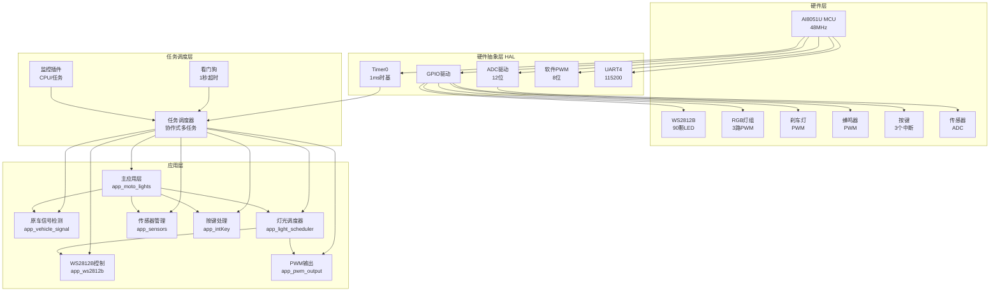

### 模块层次结构

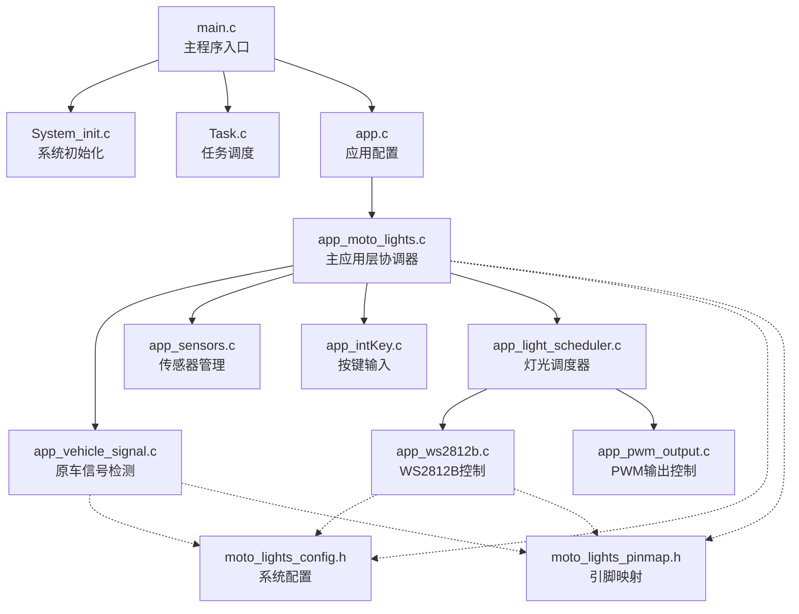

### 数据流向图

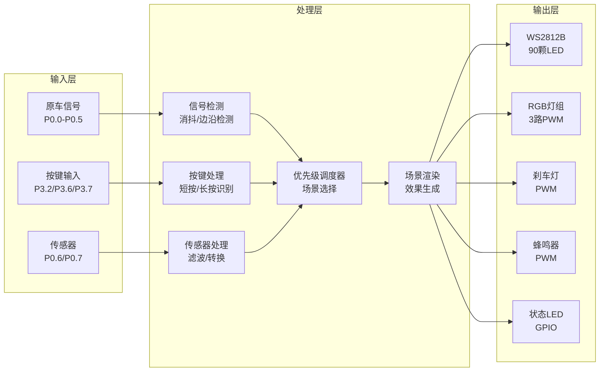

---

## 执行流程

### 系统启动流程

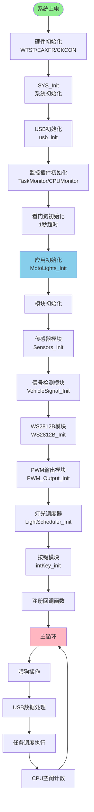

### 主循环执行流程

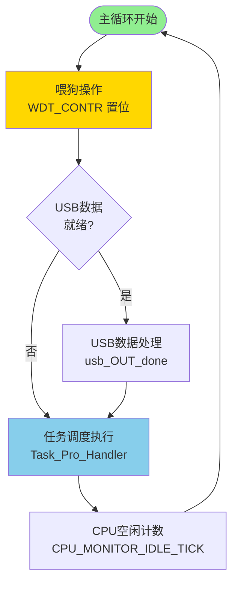

### 任务调度流程

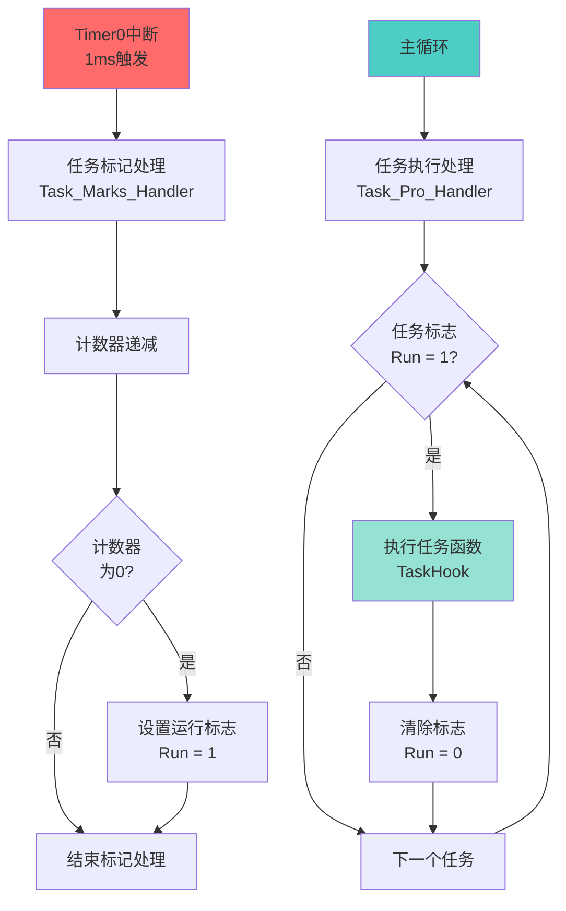

### 信号处理流程

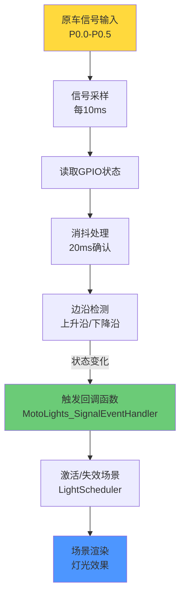

### 场景调度流程

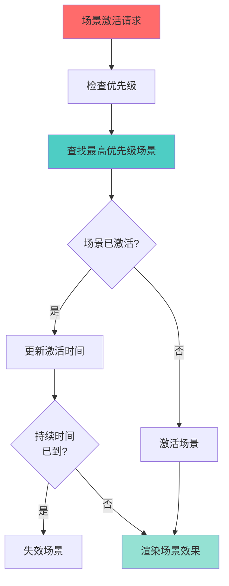

---

## 时序设计

### 任务调度时序图

```mermaid
gantt
    title 任务调度时序图（0-100ms）
    dateFormat X
    axisFormat %L ms
    
    section Timer0中断
    1ms中断触发 :0, 1
    1ms中断触发 :10, 1
    1ms中断触发 :20, 1
    1ms中断触发 :30, 1
    1ms中断触发 :40, 1
    1ms中断触发 :50, 1
    1ms中断触发 :60, 1
    1ms中断触发 :70, 1
    1ms中断触发 :80, 1
    1ms中断触发 :90, 1
    1ms中断触发 :100, 1
    
    section 10ms任务
    原车信号检测 :0, 10
    原车信号检测 :10, 10
    原车信号检测 :20, 10
    PWM输出更新 :0, 10
    PWM输出更新 :10, 10
    PWM输出更新 :20, 10
    按键扫描 :0, 10
    按键扫描 :10, 10
    按键扫描 :20, 10
    
    section 20ms任务
    灯光调度器 :0, 20
    灯光调度器 :20, 20
    灯光调度器 :40, 20
    
    section 50ms任务
    主应用层 :0, 50
    主应用层 :50, 50
    
    section 100ms任务
    传感器采样 :0, 100
    状态指示 :0, 100
```

### 中断与主循环交互时序

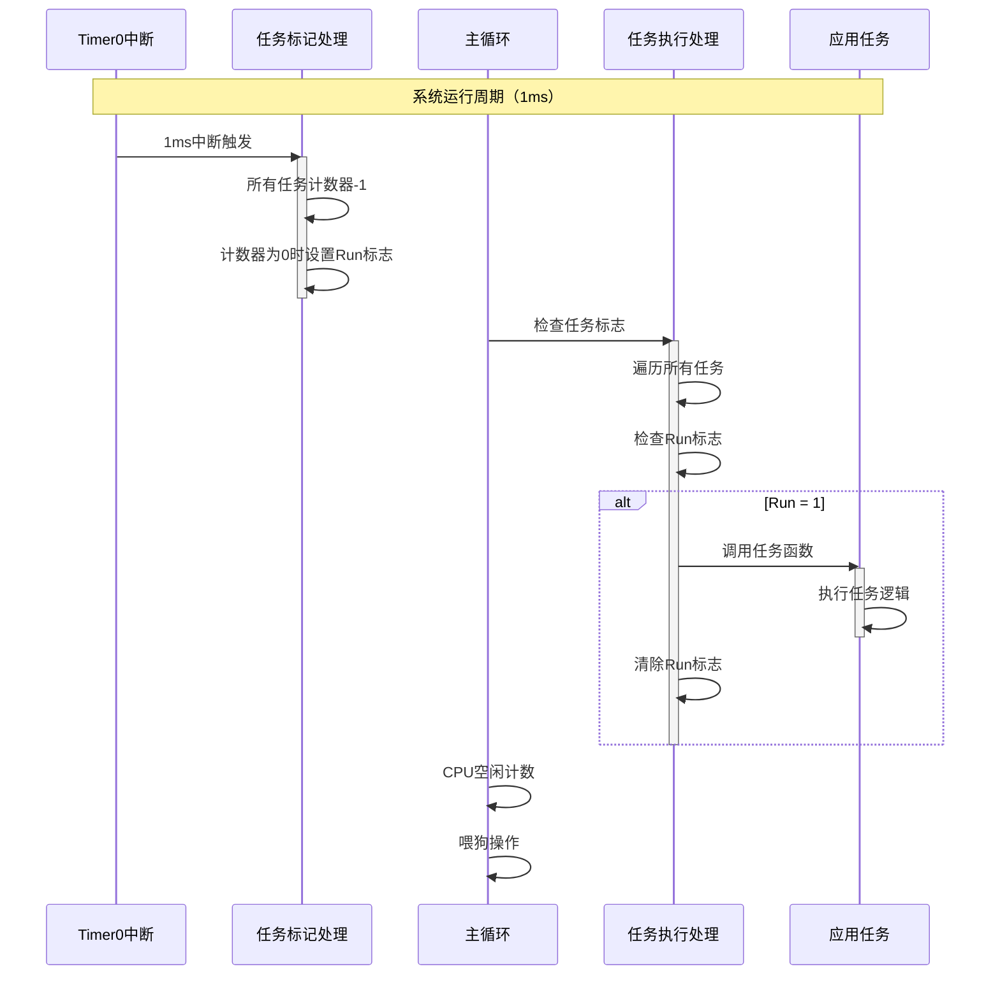

### 信号检测时序

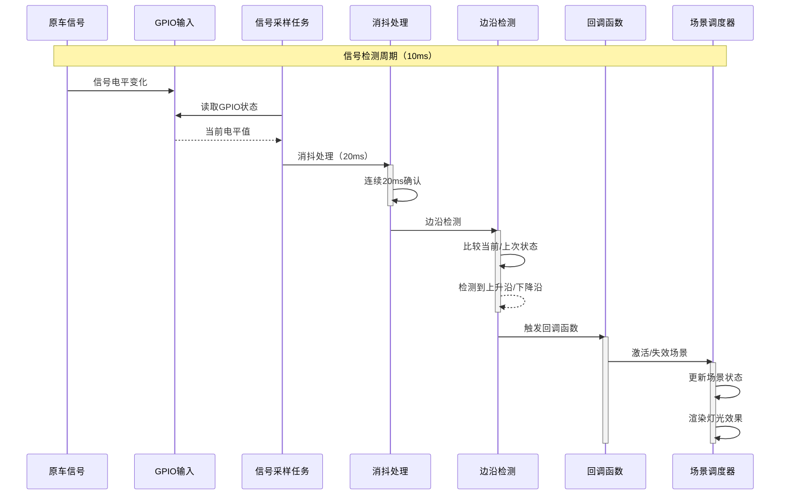

### 场景切换时序

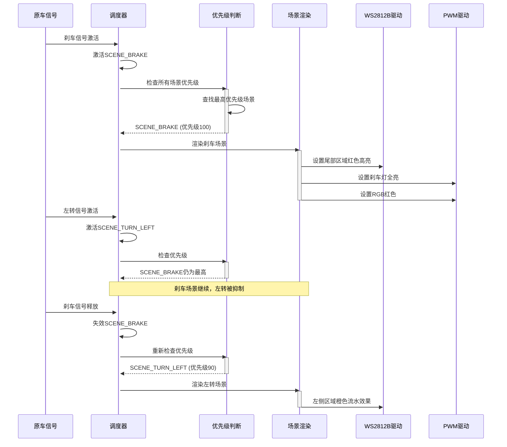

---

## 功能模块

### 1. 原车信号检测模块 (app_vehicle_signal)

#### 功能描述

检测原车信号（刹车、转向、远近光等），进行消抖处理和边沿检测，触发场景切换。

#### 核心功能

- **信号采样**：每10ms采样一次GPIO状态
- **消抖处理**：20ms连续确认，避免误触发
- **边沿检测**：检测上升沿和下降沿
- **回调机制**：信号变化时触发回调函数

#### 信号类型

| 信号类型 | 引脚 | 优先级 | 对应场景 |
|---------|------|--------|---------|
| 刹车信号 | P0.0 | 100 | SCENE_BRAKE |
| 雾灯信号 | P0.1 | 80 | SCENE_POSITION_LIGHT |
| 近光灯信号 | P0.2 | 70 | SCENE_NEAR_LIGHT |
| 远光灯信号 | P0.3 | 70 | SCENE_FAR_LIGHT |
| 左转向信号 | P0.4 | 90 | SCENE_TURN_LEFT |
| 右转向信号 | P0.5 | 90 | SCENE_TURN_RIGHT |

#### 状态机

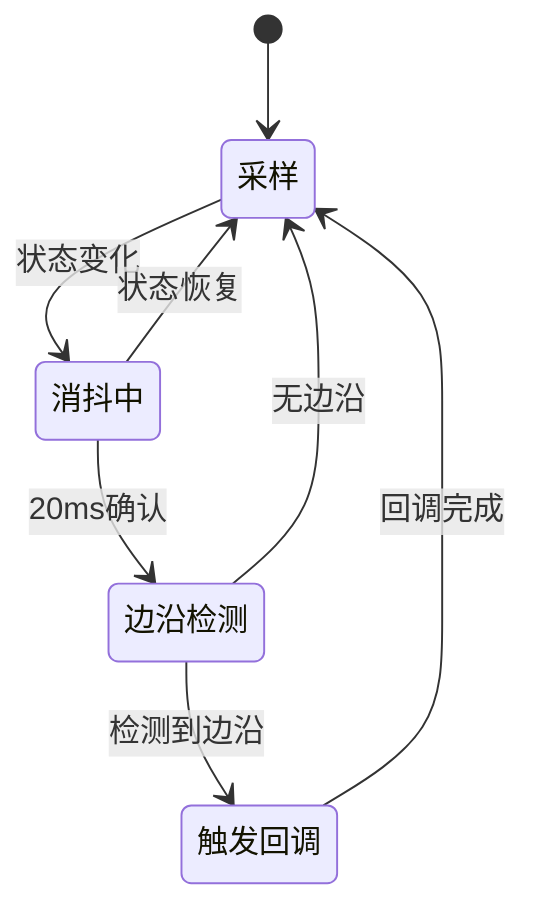

### 2. 灯光调度器模块 (app_light_scheduler)

#### 功能描述

基于优先级的场景调度系统，管理多个灯光场景的激活和渲染。

#### 优先级定义

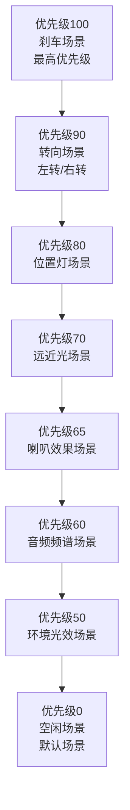

#### 场景定义

| 场景 | 优先级 | 触发条件 | 持续时间 | 灯光效果 |
|------|--------|---------|---------|---------|
| SCENE_BRAKE | 100 | 刹车信号激活 | 持续 | 尾灯+尾部区域红色高亮 |
| SCENE_TURN_LEFT | 90 | 左转信号激活 | 持续 | 左侧橙色流水效果 |
| SCENE_TURN_RIGHT | 90 | 右转信号激活 | 持续 | 右侧橙色流水效果 |
| SCENE_POSITION_LIGHT | 80 | 雾灯信号激活 | 持续 | 全部低亮度+刹车灯闪烁 |
| SCENE_NEAR_LIGHT | 70 | 近光信号激活 | 持续 | 全部中等亮度白色 |
| SCENE_FAR_LIGHT | 70 | 远光信号激活 | 持续 | 全部快闪白色 |
| SCENE_HORN_EFFECT | 65 | 音频检测到喇叭 | 3秒 | 前部红色快闪 |
| SCENE_AUDIO_SPECTRUM | 60 | 检测到音频 | 持续 | 显示8频段频谱 |
| SCENE_IDLE | 0 | 默认 | 持续 | 所有灯光关闭 |

#### 调度算法

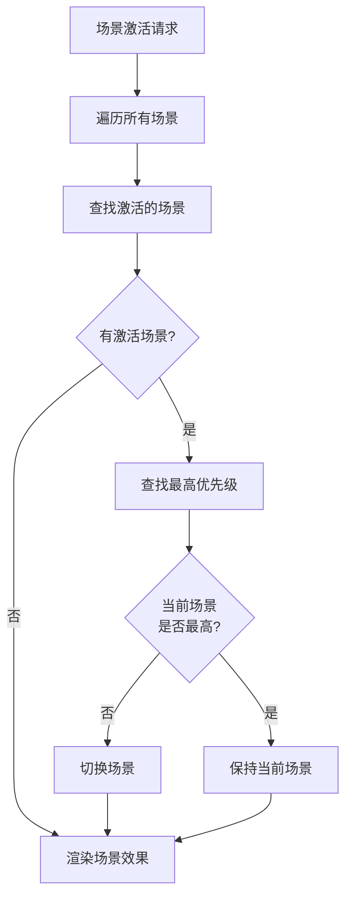

### 3. WS2812B控制模块 (app_ws2812b)

#### 功能描述

控制90颗WS2812B LED灯珠，支持多种灯光效果和区域控制。

#### 灯珠分区

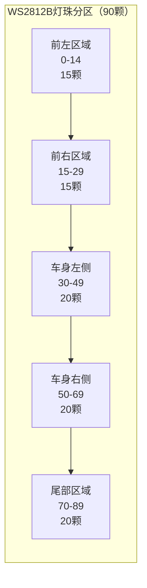

#### 灯光效果类型

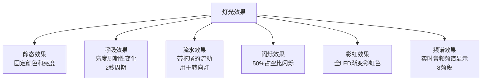

#### 效果实现原理

**流水效果（转向灯）：**
```
时间轴: 0ms    100ms   200ms   300ms   400ms   500ms
LED0:   ●      ◐      ○      ○      ○      ●
LED1:   ○      ●      ◐      ○      ○      ○
LED2:   ○      ○      ●      ◐      ○      ○
LED3:   ○      ○      ○      ●      ◐      ○
LED4:   ○      ○      ○      ○      ●      ◐
```

**呼吸效果：**
```
亮度 = 128 + 127 * sin(2π * t / 2000)
周期: 2000ms
范围: 0-255
```

### 4. PWM输出模块 (app_pwm_output)

#### 功能描述

软件PWM输出控制，支持RGB灯组、刹车灯、蜂鸣器等设备。

#### PWM通道

| 通道 | 引脚 | 功能 | 频率 | 分辨率 |
|------|------|------|------|--------|
| RGB红色 | P1.1 | RGB灯组红色 | 1000Hz | 8位(0-255) |
| RGB绿色 | P1.2 | RGB灯组绿色 | 1000Hz | 8位(0-255) |
| RGB蓝色 | P1.3 | RGB灯组蓝色 | 1000Hz | 8位(0-255) |
| 刹车灯 | P1.0 | 尾箱刹车灯 | 1000Hz | 8位(0-255) |
| 蜂鸣器 | P1.5 | 声音提示 | 可变 | 8位(0-255) |

#### PWM更新流程

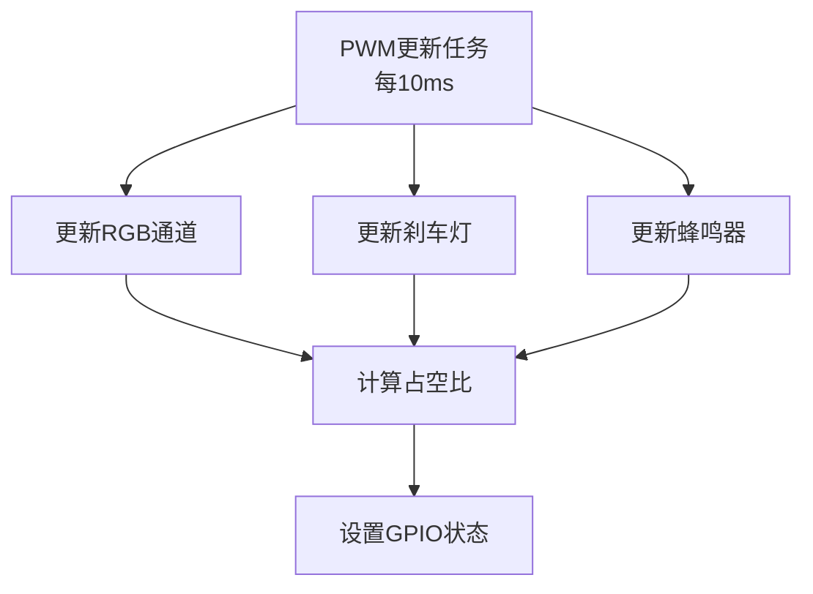

### 5. 传感器管理模块 (app_sensors)

#### 功能描述

管理光强传感器、电池电压传感器、音频传感器，进行采样、滤波和物理值转换。

#### 传感器类型

| 传感器 | 引脚 | ADC通道 | 采样周期 | 功能 |
|--------|------|---------|---------|------|
| 光强传感器 | P0.6 | ADC6 | 100ms | 环境光检测，切换白天/夜晚模式 |
| 电池电压 | P0.7 | ADC7 | 100ms | 电压监控，低电压报警 |
| 音频信号 | P0.6 | ADC6 | 100ms | 音频频谱分析 |

#### 工作模式切换

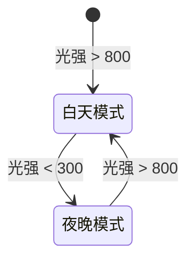

**模式参数说明：**

- **白天模式**：
  - WS2812B亮度: 180
  - RGB亮度: 高
  - 效果: 简洁明快

- **夜晚模式**：
  - WS2812B亮度: 255
  - RGB亮度: 中
  - 效果: 绚丽醒目

#### 滤波算法

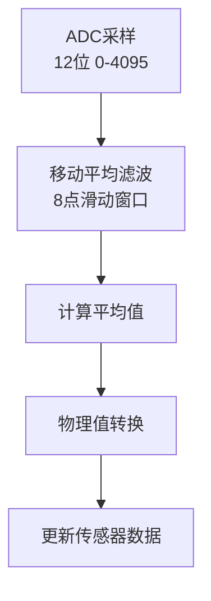

### 6. 按键处理模块 (app_intKey)

#### 功能描述

外部中断按键处理，支持短按、长按识别，消抖处理。

#### 按键定义

| 按键 | 引脚 | 中断 | 功能 |
|------|------|------|------|
| 菜单按键 | P3.7 | INT0 | 短按：进入/退出测试模式 |
| 测试按键 | P3.6 | INT2 | 短按：测试所有灯光<br/>长按：顺序测试各区域 |
| 亮度按键 | P3.2 | INT3 | 短按：循环调节亮度（33%→66%→100%） |

#### 按键状态机

```mermaid
stateDiagram-v2
    [*] --> 空闲
    空闲 --> 按下检测: 下降沿中断
    按下检测 --> 消抖中: 20ms确认
    消抖中 --> 按下确认: 状态稳定
    消抖中 --> 空闲: 状态恢复
    按下确认 --> 长按检测: 500ms计时
    长按检测 --> 长按触发: 500ms到达
    长按检测 --> 短按触发: 释放按键
    长按触发 --> 长按保持: 持续按下
    长按保持 --> 重复触发: 每200ms
    短按触发 --> 空闲
    长按触发 --> 空闲: 释放按键
    重复触发 --> 空闲: 释放按键
```

### 7. 主应用层模块 (app_moto_lights)

#### 功能描述

系统协调器，管理各模块初始化、事件处理、状态监控。

#### 系统状态

```mermaid
stateDiagram-v2
    [*] --> 初始化
    初始化 --> 正常运行: 初始化完成
    正常运行 --> 低电量: 电池电压 < 11V
    正常运行 --> 错误状态: 系统错误
    正常运行 --> 测试模式: 按键触发
    低电量 --> 正常运行: 电池电压恢复
    错误状态 --> 正常运行: 错误清除
    测试模式 --> 正常运行: 按键退出
```

#### 事件处理流程

```mermaid
flowchart TD
    EVENT[事件触发]
    KEY_EVENT{按键事件?}
    SIGNAL_EVENT{信号事件?}
    KEY_HANDLER[按键事件处理]
    SIGNAL_HANDLER[信号事件处理]
    SCENE_UPDATE[更新场景状态]
    STATE_UPDATE[更新系统状态]
    
    EVENT --> KEY_EVENT
    KEY_EVENT -->|是| KEY_HANDLER
    KEY_EVENT -->|否| SIGNAL_EVENT
    
    SIGNAL_EVENT -->|是| SIGNAL_HANDLER
    SIGNAL_EVENT -->|否| STATE_UPDATE
    
    KEY_HANDLER --> SCENE_UPDATE
    SIGNAL_HANDLER --> SCENE_UPDATE
    SCENE_UPDATE --> STATE_UPDATE
```

---

## 数据流

### 信号到灯光的完整数据流

```mermaid
flowchart LR
    subgraph "输入"
        SIG[原车信号<br/>P0.0-P0.5]
        KEY[按键输入<br/>P3.2/P3.6/P3.7]
        ADC[传感器<br/>P0.6/P0.7]
    end
    
    subgraph "处理"
        VS[信号检测<br/>消抖/边沿]
        KEY_P[按键处理<br/>短按/长按]
        SEN[传感器处理<br/>滤波/转换]
        SCHED[优先级调度<br/>场景选择]
        RENDER[场景渲染<br/>效果生成]
    end
    
    subgraph "输出"
        WS[WS2812B<br/>90颗LED]
        RGB[RGB灯组<br/>3路PWM]
        BRAKE[刹车灯<br/>PWM]
        BUZZER[蜂鸣器<br/>PWM]
        LED[状态LED<br/>GPIO]
    end
    
    SIG --> VS
    KEY --> KEY_P
    ADC --> SEN
    
    VS --> SCHED
    KEY_P --> SCHED
    SEN --> SCHED
    
    SCHED --> RENDER
    
    RENDER --> WS
    RENDER --> RGB
    RENDER --> BRAKE
    RENDER --> BUZZER
    RENDER --> LED
```

### 场景渲染数据流

```mermaid
flowchart TD
    SCENE[场景激活]
    GET_PRIORITY[获取场景优先级]
    CHECK_MAX{是否为<br/>最高优先级?}
    GET_EFFECT[获取场景效果参数]
    CALC_COLOR[计算颜色值]
    APPLY_BRIGHTNESS[应用亮度]
    UPDATE_WS2812B[更新WS2812B缓冲区]
    UPDATE_PWM[更新PWM占空比]
    SEND_DATA[发送数据到硬件]
    
    SCENE --> GET_PRIORITY
    GET_PRIORITY --> CHECK_MAX
    CHECK_MAX -->|是| GET_EFFECT
    CHECK_MAX -->|否| WAIT[等待]
    GET_EFFECT --> CALC_COLOR
    CALC_COLOR --> APPLY_BRIGHTNESS
    APPLY_BRIGHTNESS --> UPDATE_WS2812B
    APPLY_BRIGHTNESS --> UPDATE_PWM
    UPDATE_WS2812B --> SEND_DATA
    UPDATE_PWM --> SEND_DATA
```

---

## 性能指标

### 任务执行时间分析

| 任务名称 | 周期 | 平均执行时间 | CPU占用率 | 说明 |
|---------|------|------------|----------|------|
| Sample_VehicleSignal | 10ms | < 0.5ms | < 5% | 信号检测和消抖 |
| Sample_PWM_Output | 10ms | < 0.3ms | < 3% | PWM输出更新 |
| Sample_LightScheduler | 20ms | < 2ms | < 10% | 场景调度和渲染 |
| Sample_MotoLights_App | 50ms | < 1ms | < 2% | 主应用逻辑 |
| Sample_Sensors | 100ms | < 1ms | < 1% | 传感器采样 |
| Sample_StatusIndicator | 100ms | < 0.1ms | < 0.1% | 状态LED控制 |
| Sample_intKey | 10ms | < 0.2ms | < 2% | 按键扫描 |
| CPUMonitor_Calculate | 1000ms | < 0.5ms | < 0.05% | CPU监控 |
| TaskMonitor_PrintReport | 5000ms | < 1ms | < 0.02% | 任务监控报告 |

### 响应时间分析

```mermaid
gantt
    title 系统响应时间分析
    dateFormat X
    axisFormat %L ms
    
    section 信号检测到灯光响应
    信号输入 :0, 1
    信号采样 :0, 10
    消抖处理 :10, 20
    边沿检测 :30, 1
    回调触发 :31, 1
    场景激活 :32, 1
    场景渲染 :33, 2
    灯光更新 :35, 5
    总计响应时间 :0, 40
    
    section 按键检测到功能响应
    按键按下 :0, 1
    中断触发 :0, 1
    消抖确认 :1, 20
    事件识别 :21, 1
    回调触发 :22, 1
    功能执行 :23, 2
    总计响应时间 :0, 25
```

### CPU占用率分析

```mermaid
pie title CPU占用率分布（正常运行时）
    "任务执行" : 25
    "中断处理" : 3
    "空闲" : 72
```

### 内存使用分析

| 模块 | RAM使用 | 说明 |
|------|---------|------|
| WS2812B缓冲区 | 270字节 | 90颗LED × 3字节 |
| 任务调度器 | 50字节 | 场景状态和优先级 |
| 信号检测 | 30字节 | 信号状态和消抖 |
| 传感器数据 | 40字节 | 采样数据和滤波 |
| 系统信息 | 20字节 | 系统状态和运行时间 |
| 其他 | 100字节 | 临时变量和栈 |
| **总计** | **~510字节** | 约占总RAM的12% |

---

## 总结

### 系统特点

1. **模块化设计**：各功能模块独立，接口清晰，便于维护和扩展
2. **事件驱动**：基于回调机制，响应及时，资源占用低
3. **优先级调度**：确保安全功能（如刹车）的最高优先级
4. **实时性保证**：任务周期设计合理，响应时间 < 50ms
5. **可扩展性强**：预留接口支持后续功能增强

### 技术亮点

- ✅ 协作式多任务调度，基于1ms时基
- ✅ 优先级场景调度机制，自动切换
- ✅ 多种灯光效果，支持区域控制
- ✅ 环境光自适应，白天/夜晚模式自动切换
- ✅ 完善的监控系统，CPU和任务性能分析
- ✅ 看门狗保护，防止系统死锁

### 应用场景

- 摩托车智能灯光系统
- 电动车氛围灯控制
- 汽车装饰灯光系统
- 其他需要多场景灯光控制的场合

---

**文档版本：** V1.0  
**最后更新：** 2025-11-17  
**文档状态：** ✅ 完整可用

