# 摩托车智能联动灯组系统 - 电路原理图

> **版本：** v1.0.0  
> **日期：** 2025-11-17  
> **平台：** AI8051U (48MHz)  
> **作者：** Sherwin.Chen

---

## 📋 目录

1. [系统总览](#系统总览)
2. [MCU核心电路](#mcu核心电路)
3. [电源电路](#电源电路)
4. [输入信号电路](#输入信号电路)
5. [输出驱动电路](#输出驱动电路)
6. [WS2812B驱动电路](#ws2812b驱动电路)
7. [按键电路](#按键电路)
8. [调试接口电路](#调试接口电路)
9. [完整连接表](#完整连接表)

---

## 系统总览

### 系统架构框图

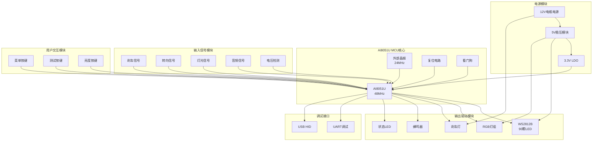

### 系统连接总览

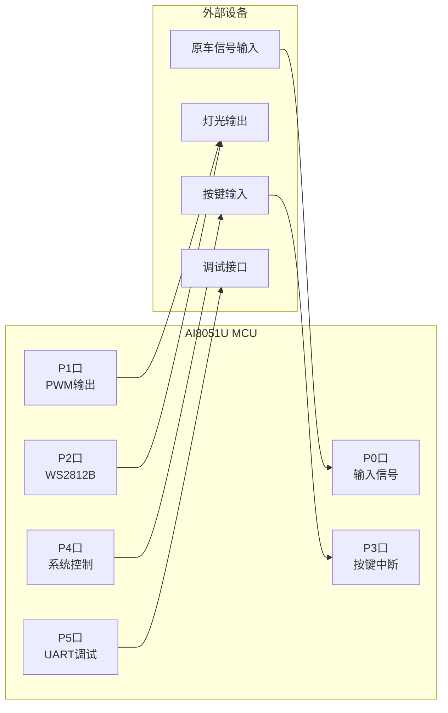

---

## MCU核心电路

### AI8051U最小系统

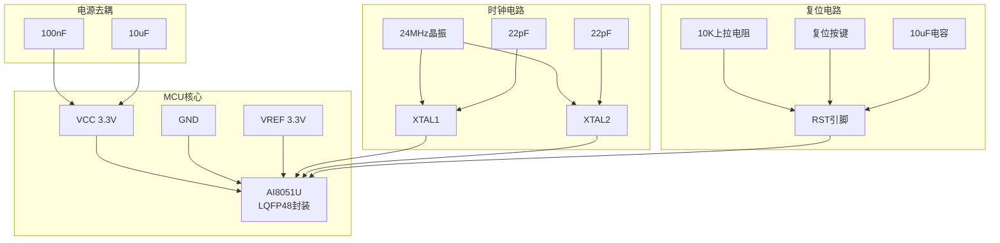

**电路说明：**

- **MCU供电**：3.3V，通过LDO从5V转换
- **时钟源**：外部24MHz晶振，内部倍频至48MHz
- **复位电路**：RC复位 + 按键复位
- **去耦电容**：每个电源引脚附近放置100nF，总电源处放置10uF

---

## 电源电路

### 电源分配方案

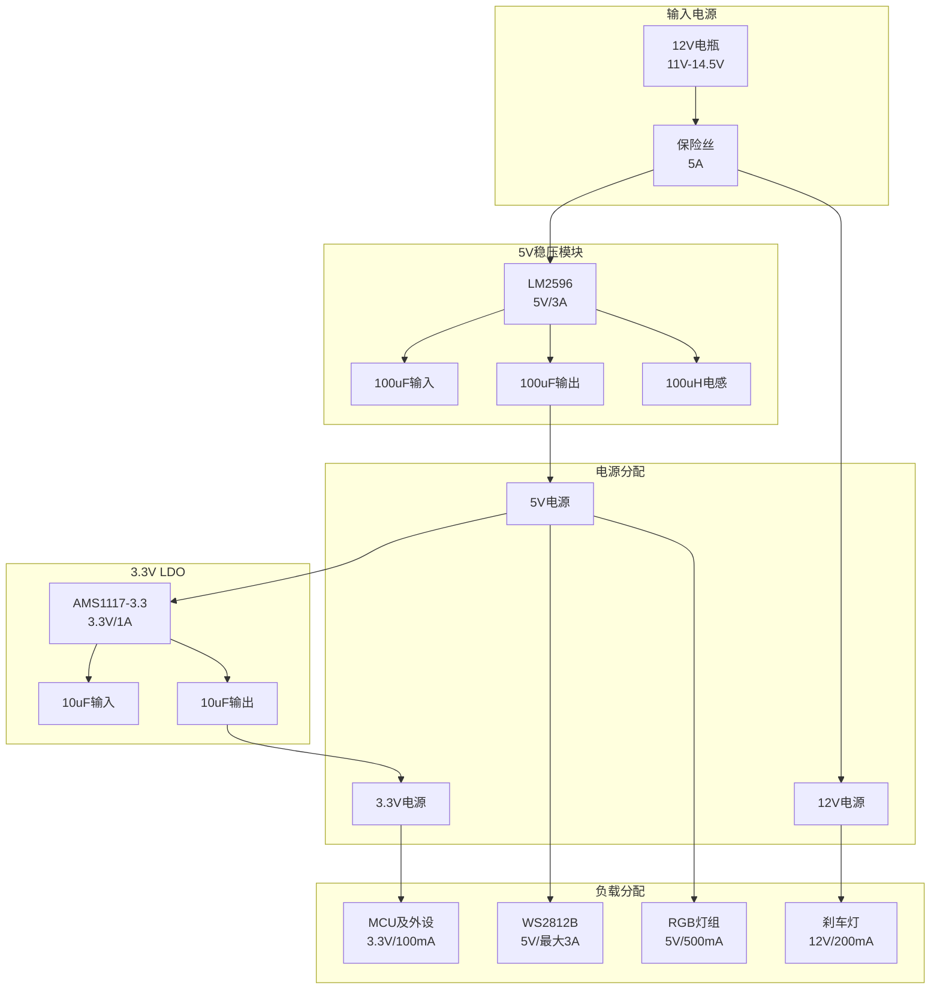

### 电压分压电路（电池电压检测）

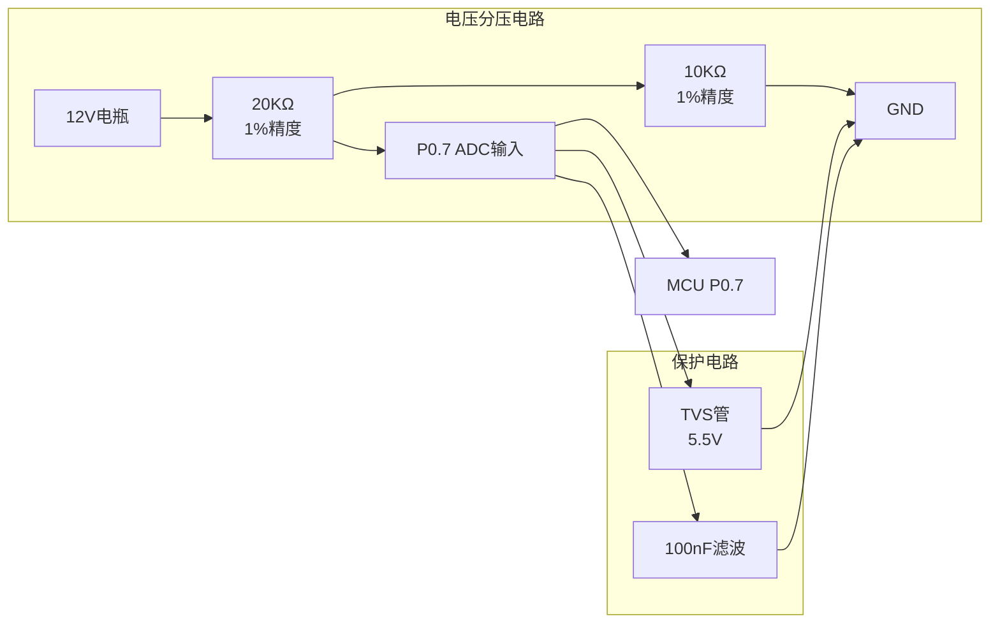

**计算公式：**
```
实际电压 = (ADC值 / 4096) × 3.3V × (R1+R2)/R2
         = (ADC值 / 4096) × 3.3V × 3
         = ADC值 × 0.00242V
```

**电压范围：**
- 输入范围：0-15V（理论）
- ADC输入范围：0-3.3V（实际）
- 测量范围：0-11V（有效）

---

## 输入信号电路

### 原车信号输入电路（P0.0-P0.5）

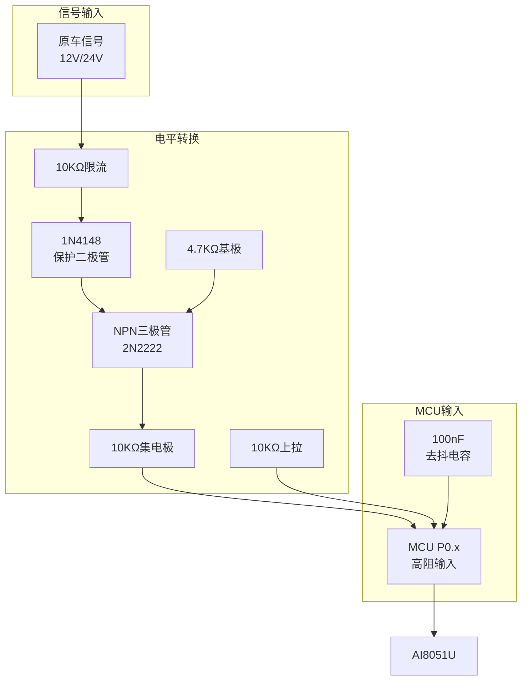

**信号类型：**
- 刹车信号 (P0.0)
- 雾灯信号 (P0.1)
- 近光灯信号 (P0.2)
- 远光灯信号 (P0.3)
- 左转向信号 (P0.4)
- 右转向信号 (P0.5)

**电路特点：**
- 电平转换：12V/24V → 3.3V
- 反向保护：防止负电压
- 上拉电阻：确保无信号时为高电平
- 去抖电容：硬件消抖

### 音频信号输入电路（P0.6 ADC）

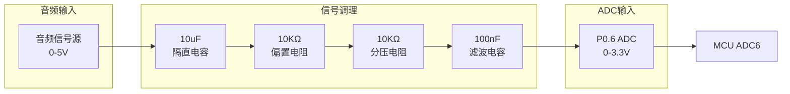

**信号处理：**
- 隔直：去除DC分量
- 偏置：1.65V中心点
- 限幅：0-3.3V范围
- 滤波：去除高频噪声

---

## 输出驱动电路

### PWM输出电路（P1.0-P1.3, P1.5）

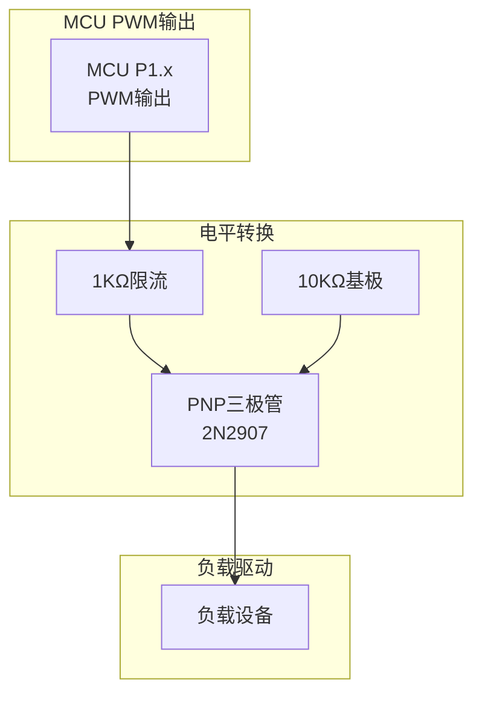

**PWM通道分配：**

| 引脚 | 功能 | 负载 | 驱动电流 |
|------|------|------|---------|
| P1.0 | 刹车灯 | 12V LED | 200mA |
| P1.1 | RGB红色 | 5V RGB LED | 100mA |
| P1.2 | RGB绿色 | 5V RGB LED | 100mA |
| P1.3 | RGB蓝色 | 5V RGB LED | 100mA |
| P1.5 | 蜂鸣器 | 5V有源蜂鸣器 | 50mA |

### RGB灯组驱动电路

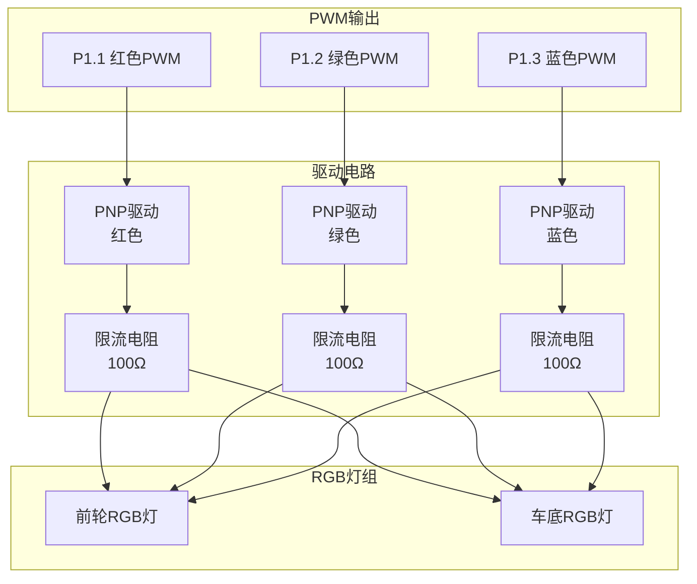

### 刹车灯驱动电路

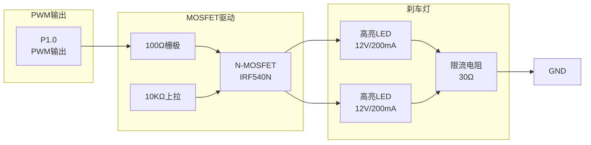

### 蜂鸣器驱动电路

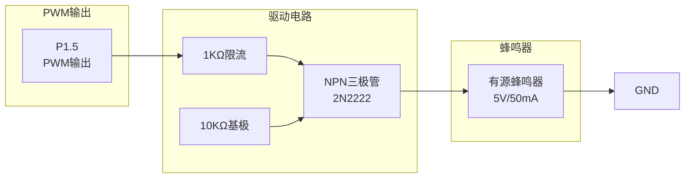

### 状态LED电路

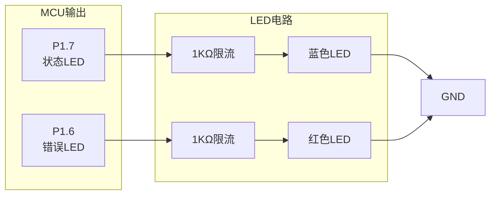

---

## WS2812B驱动电路

### WS2812B连接电路

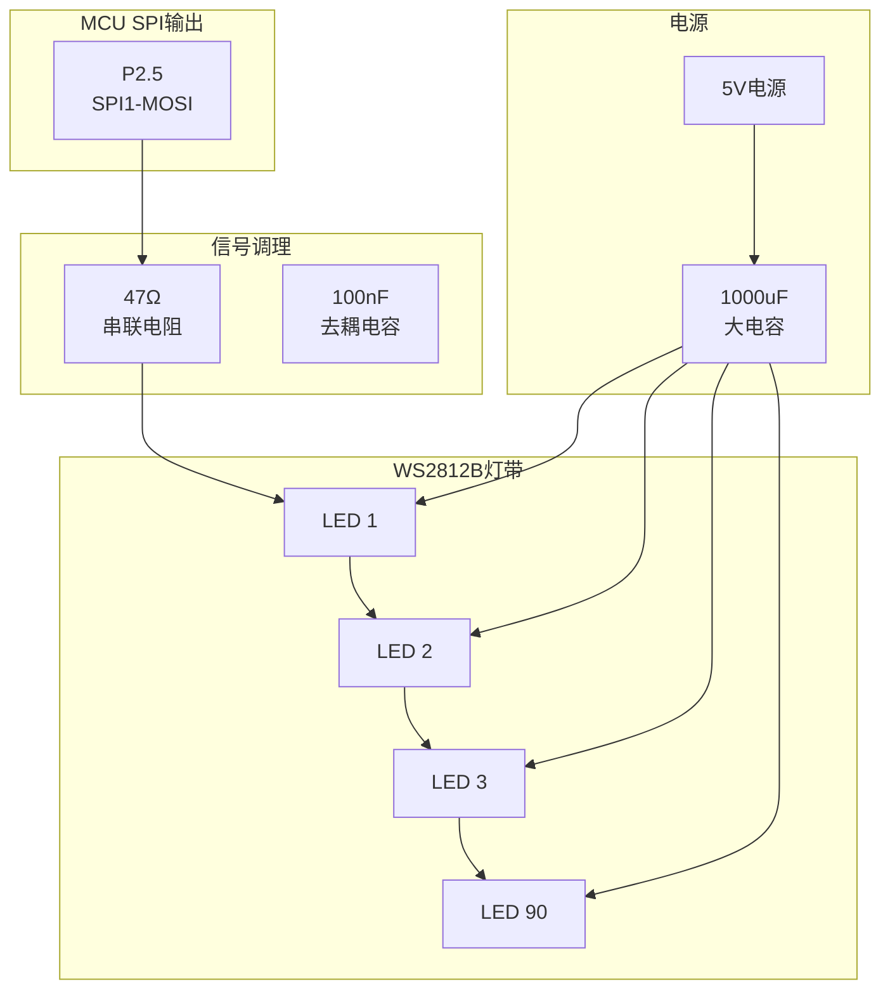

**电路说明：**

- **数据线**：P2.5 (SPI1-MOSI)，800kHz速率
- **串联电阻**：47Ω，匹配阻抗，减少反射
- **去耦电容**：每个LED附近100nF，总电源处1000uF
- **电源要求**：5V稳定，最大电流3A（90颗全亮时）

### WS2812B灯珠分区连接

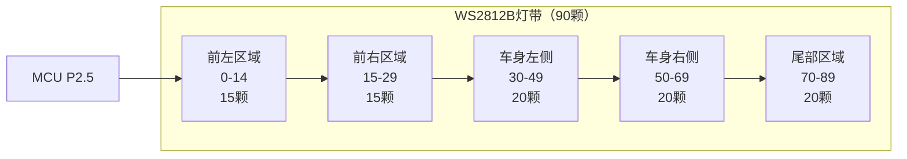

**连接方式：**
- 串联连接：数据线依次连接
- 电源并联：所有LED共用5V电源
- 地线共用：所有LED共用GND

---

## 按键电路

### 外部中断按键电路

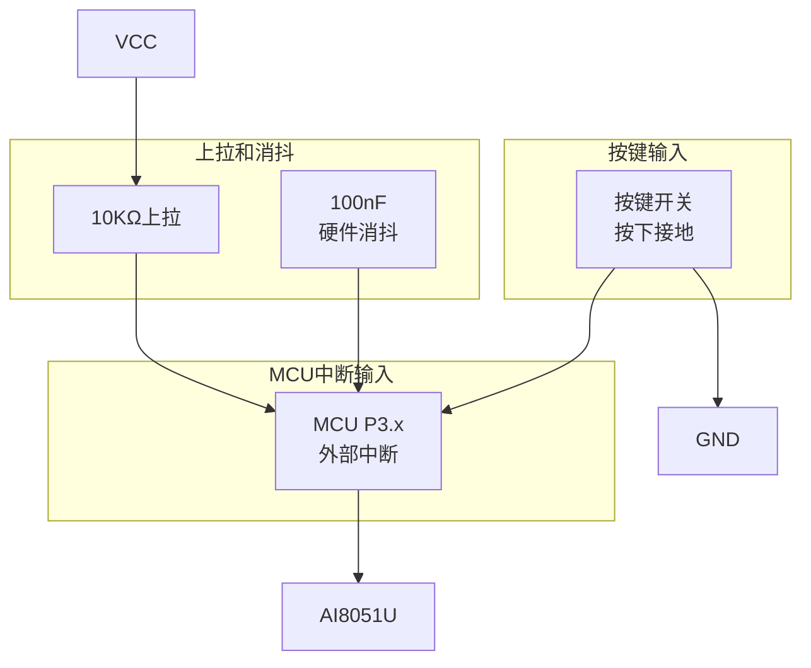

**按键分配：**

| 按键 | 引脚 | 中断 | 功能 |
|------|------|------|------|
| 菜单按键 | P3.7 | INT0 | 进入/退出测试模式 |
| 测试按键 | P3.6 | INT2 | 测试所有灯光 |
| 亮度按键 | P3.2 | INT3 | 调节亮度 |

**电路特点：**
- 下拉式按键：按下时接地
- 上拉电阻：确保无按键时为高电平
- 硬件消抖：100nF电容
- 软件消抖：20ms确认

---

## 调试接口电路

### UART调试接口

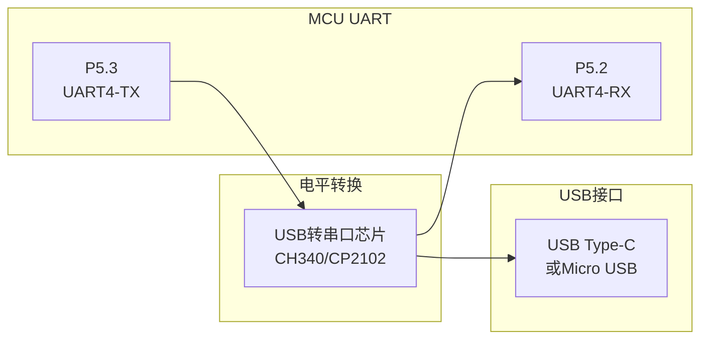

**通信参数：**
- 波特率：115200
- 数据位：8
- 停止位：1
- 校验位：无
- 流控：无

### 程序烧写接口

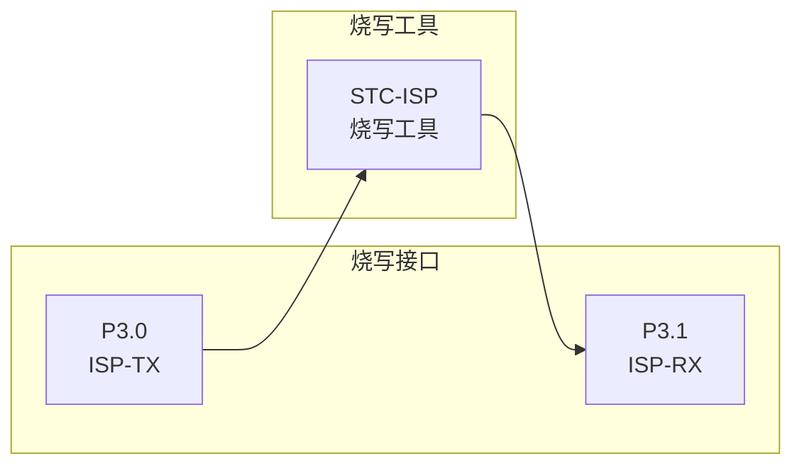

**烧写说明：**
- 使用STC-ISP工具
- 通过P3.0/P3.1进行ISP下载
- 支持冷启动下载

---

## 完整连接表

### MCU引脚完整连接表

| 引脚 | 功能 | 类型 | 连接设备 | 说明 |
|------|------|------|---------|------|
| **P0口 - 输入信号** |
| P0.0 | 刹车信号 | 数字输入 | 原车刹车信号 | 电平转换后输入 |
| P0.1 | 雾灯信号 | 数字输入 | 原车雾灯信号 | 电平转换后输入 |
| P0.2 | 近光灯信号 | 数字输入 | 原车近光信号 | 电平转换后输入 |
| P0.3 | 远光灯信号 | 数字输入 | 原车远光信号 | 电平转换后输入 |
| P0.4 | 左转向信号 | 数字输入 | 原车左转信号 | 电平转换后输入 |
| P0.5 | 右转向信号 | 数字输入 | 原车右转信号 | 电平转换后输入 |
| P0.6 | 音频信号 | ADC输入 | 音频信号源 | 信号调理后输入 |
| P0.7 | 电池电压 | ADC输入 | 12V电瓶 | 分压电路后输入 |
| **P1口 - PWM输出** |
| P1.0 | 刹车灯 | PWM输出 | MOSFET驱动→刹车灯 | 12V/200mA |
| P1.1 | RGB红色 | PWM输出 | PNP驱动→RGB灯 | 5V/100mA |
| P1.2 | RGB绿色 | PWM输出 | PNP驱动→RGB灯 | 5V/100mA |
| P1.3 | RGB蓝色 | PWM输出 | PNP驱动→RGB灯 | 5V/100mA |
| P1.5 | 蜂鸣器 | PWM输出 | NPN驱动→蜂鸣器 | 5V/50mA |
| P1.6 | 错误LED | 数字输出 | 红色LED | 1KΩ限流 |
| P1.7 | 状态LED | 数字输出 | 蓝色LED | 1KΩ限流 |
| **P2口 - WS2812B** |
| P2.5 | WS2812B数据 | SPI输出 | WS2812B灯带 | 47Ω串联电阻 |
| **P3口 - 按键中断** |
| P3.0 | ISP-TX | UART | STC-ISP烧写 | 程序下载 |
| P3.1 | ISP-RX | UART | STC-ISP烧写 | 程序下载 |
| P3.2 | 亮度按键 | 外部中断 | 亮度调节按键 | INT3，下拉式 |
| P3.6 | 测试按键 | 外部中断 | 测试按键 | INT2，下拉式 |
| P3.7 | 菜单按键 | 外部中断 | 菜单按键 | INT0，下拉式 |
| **P4口 - 系统控制** |
| P4.6 | 掉电检测 | 数字输入 | 电源监控 | 掉电保护 |
| P4.7 | 系统复位 | 数字输入 | 复位按键 | 硬件复位 |
| **P5口 - 调试通信** |
| P5.2 | UART4-RX | UART输入 | USB转串口 | 调试接收 |
| P5.3 | UART4-TX | UART输出 | USB转串口 | 调试发送 |

### 电源连接表

| 电源 | 电压 | 电流 | 连接设备 | 说明 |
|------|------|------|---------|------|
| 12V | 12V | 最大3.5A | 电瓶输入 | 主电源 |
| 5V | 5V | 最大3A | WS2812B、RGB灯组 | LM2596稳压 |
| 3.3V | 3.3V | 最大100mA | MCU及外设 | AMS1117-3.3 |

### 信号连接表

| 信号名称 | 来源 | 目标 | 电平 | 说明 |
|---------|------|------|------|------|
| 刹车信号 | 原车ECU | P0.0 | 12V→3.3V | 电平转换 |
| 雾灯信号 | 原车ECU | P0.1 | 12V→3.3V | 电平转换 |
| 近光信号 | 原车ECU | P0.2 | 12V→3.3V | 电平转换 |
| 远光信号 | 原车ECU | P0.3 | 12V→3.3V | 电平转换 |
| 左转信号 | 原车ECU | P0.4 | 12V→3.3V | 电平转换 |
| 右转信号 | 原车ECU | P0.5 | 12V→3.3V | 电平转换 |
| 音频信号 | 音频源 | P0.6 | 0-5V→0-3.3V | ADC采样 |
| 电压信号 | 电瓶 | P0.7 | 12V→0-3.3V | 分压后ADC |

---

## 电路设计要点

### 1. 电源设计

- **输入保护**：5A保险丝，防止过流
- **稳压模块**：LM2596（5V/3A），效率高
- **LDO稳压**：AMS1117-3.3（3.3V/1A），纹波小
- **去耦电容**：每个IC附近100nF，总电源处大电容

### 2. 信号隔离

- **电平转换**：12V/24V信号转换为3.3V
- **反向保护**：二极管防止负电压
- **滤波处理**：RC滤波去除噪声

### 3. 驱动能力

- **PWM驱动**：使用三极管/MOSFET增强驱动能力
- **限流保护**：电阻限流保护LED
- **散热考虑**：大功率器件加散热片

### 4. 抗干扰设计

- **去耦电容**：每个电源引脚附近
- **滤波电容**：信号输入处
- **屏蔽处理**：敏感信号线屏蔽
- **地线设计**：单点接地，减少干扰

### 5. 安全保护

- **TVS保护**：ADC输入处TVS管保护
- **保险丝**：电源输入处保险丝
- **过流保护**：限流电阻保护

---

## PCB布局建议

### 布局原则

1. **电源分区**：12V、5V、3.3V分区布局
2. **信号隔离**：数字信号与模拟信号分离
3. **地线设计**：大面积铺地，单点接地
4. **去耦就近**：去耦电容靠近IC放置
5. **走线宽度**：电源线加粗，信号线细线

### 关键区域

- **MCU区域**：核心区域，去耦电容密集
- **电源区域**：稳压模块，大电容
- **输入区域**：信号调理电路
- **输出区域**：驱动电路，远离敏感信号
- **调试区域**：UART接口，便于连接

---

## 元件清单

### 主要元件

| 元件 | 型号/规格 | 数量 | 说明 |
|------|----------|------|------|
| MCU | AI8051U | 1 | 主控芯片 |
| 晶振 | 24MHz | 1 | 外部时钟 |
| 稳压芯片 | LM2596 | 1 | 5V稳压 |
| LDO | AMS1117-3.3 | 1 | 3.3V稳压 |
| 三极管 | 2N2222 | 5 | NPN驱动 |
| 三极管 | 2N2907 | 3 | PNP驱动 |
| MOSFET | IRF540N | 1 | 刹车灯驱动 |
| TVS管 | 5.5V | 1 | ADC保护 |
| 保险丝 | 5A | 1 | 电源保护 |

### 阻容元件

| 元件 | 规格 | 数量 | 说明 |
|------|------|------|------|
| 电阻 | 10KΩ | 15 | 上拉/限流 |
| 电阻 | 1KΩ | 5 | 限流 |
| 电阻 | 100Ω | 3 | RGB限流 |
| 电阻 | 47Ω | 1 | WS2812B串联 |
| 电阻 | 20KΩ | 1 | 分压 |
| 电阻 | 4.7KΩ | 1 | 基极 |
| 电容 | 100nF | 20 | 去耦 |
| 电容 | 10uF | 5 | 滤波 |
| 电容 | 1000uF | 1 | 大电容 |
| 电容 | 22pF | 2 | 晶振 |

---

## 测试点说明

### 关键测试点

| 测试点 | 位置 | 测试内容 | 正常值 |
|--------|------|---------|--------|
| TP1 | 12V输入 | 电源电压 | 11V-14.5V |
| TP2 | 5V输出 | 5V稳压 | 5.0V±0.1V |
| TP3 | 3.3V输出 | 3.3V稳压 | 3.3V±0.05V |
| TP4 | P0.7 | 电压检测 | 0-3.3V |
| TP5 | P2.5 | WS2812B数据 | 0-5V方波 |
| TP6 | P1.0 | 刹车灯PWM | 0-12V PWM |

---

## 注意事项

### 设计注意事项

1. **电源容量**：确保电源模块容量足够（3A以上）
2. **散热设计**：大功率器件需要散热
3. **EMC设计**：敏感信号线远离干扰源
4. **可维护性**：关键测试点预留，便于调试
5. **可靠性**：关键信号增加保护电路

### 安装注意事项

1. **防水处理**：控制器需安装在防水盒内
2. **固定牢固**：防止振动导致接触不良
3. **线径选择**：电源线使用1.5mm²以上
4. **保险丝**：必须安装保险丝保护
5. **接地**：确保良好接地

---

**文档版本：** v1.0.0  
**最后更新：** 2025-11-17  
**文档状态：** ✅ 完整可用

