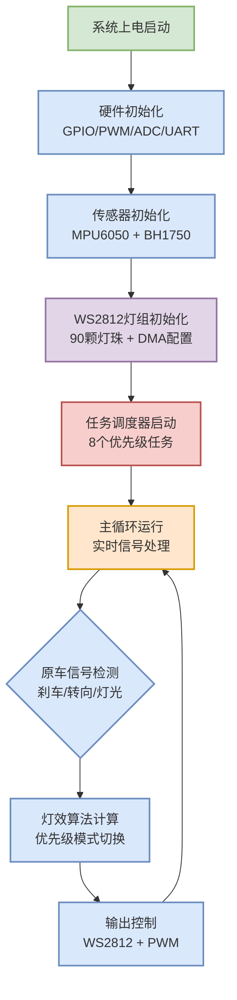

# 📊 摩托车智能联动灯组系统 - 主程序执行流程图

## 流程图说明

本流程图展示了摩托车智能联动灯组系统的主程序执行流程，从系统上电启动到主循环运行的完整过程。

---

## Mermaid 流程图



---

## ASCII 流程图

```
┌─────────────────┐
│   系统上电启动   │
└─────────┬───────┘
          │
          ▼
┌─────────────────┐
│ 硬件初始化      │
│ GPIO/PWM/ADC/   │
│ UART 配置       │
└─────────┬───────┘
          │
          ▼
┌─────────────────┐
│ 传感器初始化    │
│ MPU6050 +       │
│ BH1750 配置     │
└─────────┬───────┘
          │
          ▼
┌─────────────────┐
│ WS2812灯组初始化│
│ 90颗灯珠 +      │
│ DMA 配置        │
└─────────┬───────┘
          │
          ▼
┌─────────────────┐
│ 任务调度器启动  │
│ 8个优先级任务   │
└─────────┬───────┘
          │
          ▼
┌─────────────────┐   ┌─────────────┐
│   主循环运行     │◄──┤ 输出控制    │
│ 实时信号处理    │   │ WS2812 + PWM│
└─────────┬───────┘   └─────────────┘
          │
          ▼
┌─────────────────┐
│ 原车信号检测    │
│ 刹车/转向/灯光  │
└─────────┬───────┘
          │
          ▼
┌─────────────────┐
│ 灯效算法计算    │
│ 优先级模式切换  │
└─────────────────┘
```

---

## 详细流程说明

### 1. 系统启动阶段

#### 上电启动
- MCU上电复位
- 内部时钟稳定
- 电源电压检测
- 看门狗初始化

#### 硬件初始化
- **GPIO配置：** 设置输入输出方向
- **PWM初始化：** 配置多路PWM输出
- **ADC配置：** 设置音频和电压采样
- **UART配置：** 初始化调试串口

#### 传感器初始化
- **MPU6050：** I2C通信，配置加速度计
- **BH1750：** I2C通信，配置光强传感器
- **通信测试：** 验证传感器连接状态

#### WS2812初始化
- **SPI配置：** 高速输出模式
- **DMA配置：** 数据传输通道
- **缓冲区分配：** 扩展RAM空间
- **通信测试：** 灯珠响应检测

#### 任务调度启动
- **任务注册：** 8个优先级任务
- **Timer0配置：** 1ms中断节拍
- **调度器启动：** 优先级队列初始化
- **监控插件：** 性能监控使能

### 2. 主循环阶段

#### 信号检测分支
- **刹车信号：** 上升沿触发检测
- **转向信号：** 左/右转向识别
- **灯光信号：** 远近光灯状态
- **其他信号：** 雾灯、喇叭等

#### 算法计算分支
- **优先级判断：** 安全优先级排序
- **模式切换：** 状态机转换逻辑
- **灯效计算：** RGB颜色算法
- **环境适应：** 光强自适应调节

#### 输出控制分支
- **WS2812控制：** DMA数据传输
- **PWM控制：** 多路占空比调节
- **状态指示：** LED闪烁模式
- **蜂鸣器控制：** 音调频率输出

---

## 关键节点说明

### 决策节点
- **优先级判断：** 刹车 > 转向 > 位置灯 > 远近光 > 音乐
- **模式切换：** 根据信号状态自动切换工作模式
- **故障处理：** 传感器异常时的降级运行策略

### 数据流向
- **输入流：** 传感器数据 → 信号处理 → 算法计算
- **输出流：** 算法结果 → PWM控制 → 灯效显示
- **反馈流：** 状态监控 → 调试输出 → 系统调整

### 性能指标
- **初始化时间：** <100ms
- **循环周期：** 1ms (Timer0中断)
- **响应延迟：** <2ms (信号到灯效)
- **CPU占用：** ~12% (48MHz)

---

## 异常处理流程

```
主循环
├── 正常处理
│   ├── 信号检测
│   ├── 算法计算
│   └── 输出控制
└── 异常处理
    ├── 电源异常 → 低功耗模式
    ├── 传感器故障 → 降级运行
    ├── WS2812故障 → PWM备用
    └── 系统错误 → 看门狗复位
```

---

## 流程图图例

| 符号 | 含义 | 颜色 |
|------|------|------|
| 🔄 | 循环/重复 | 橙色 |
| ▶️ | 流程方向 | 黑色箭头 |
| 🔷 | 开始/结束 | 绿色 |
| 🔳 | 处理步骤 | 蓝色 |
| 🔶 | 传感器相关 | 紫色 |
| 🟡 | 灯效相关 | 黄色 |
| 🔴 | 调度相关 | 红色 |

---

**图表版本：** v1.0
**更新时间：** 2025-10-31
**适用范围：** 主程序执行流程
