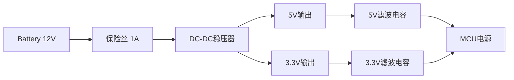
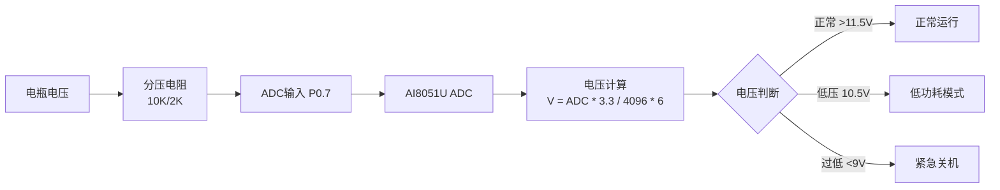
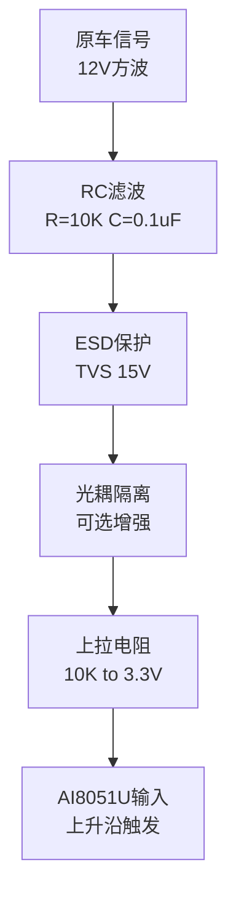
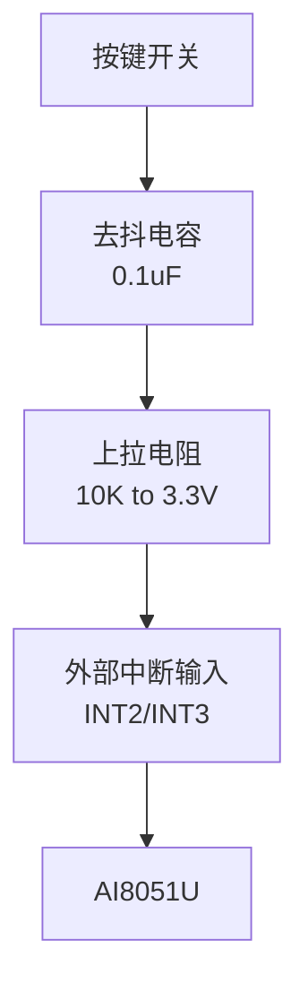
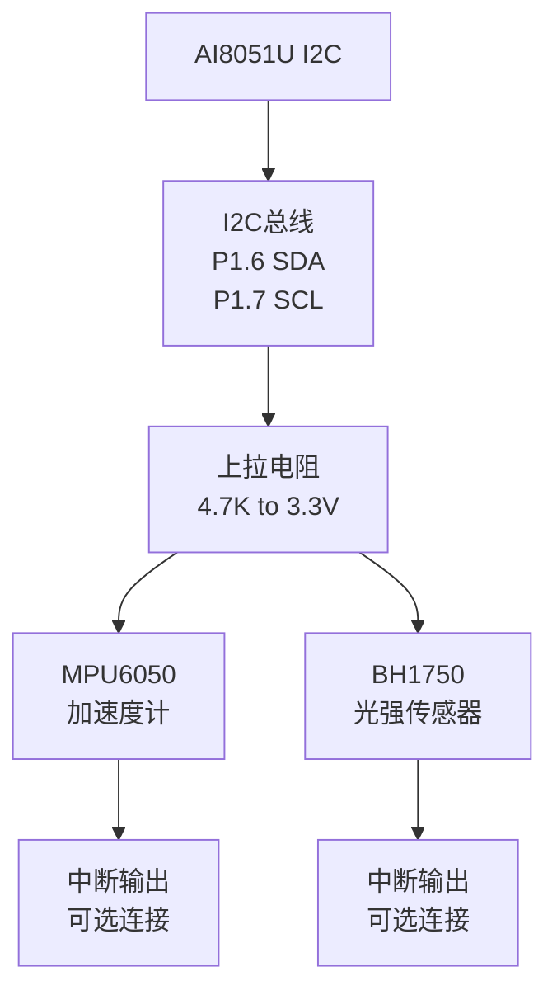
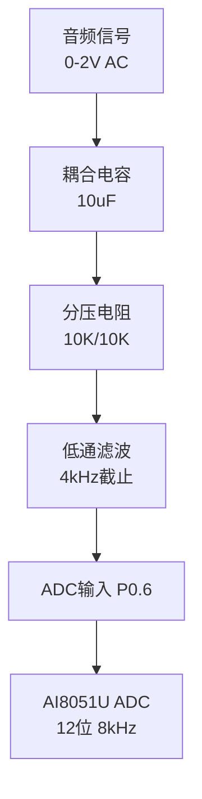
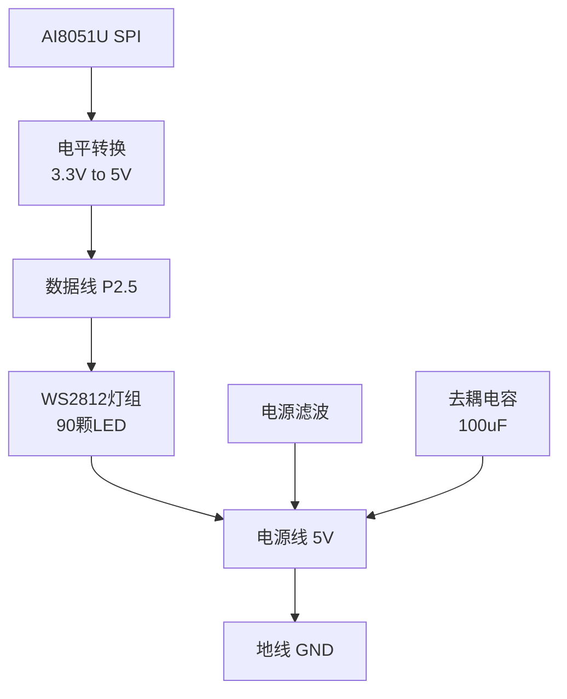
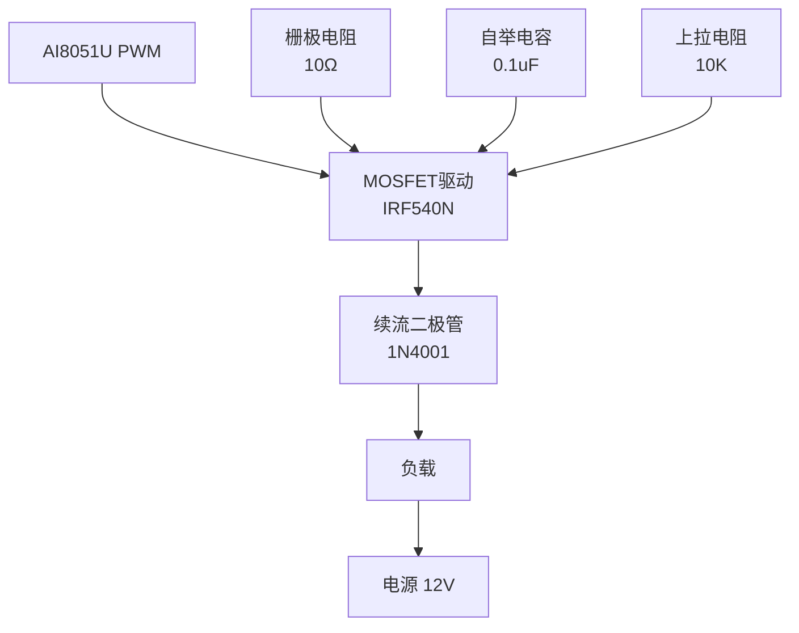
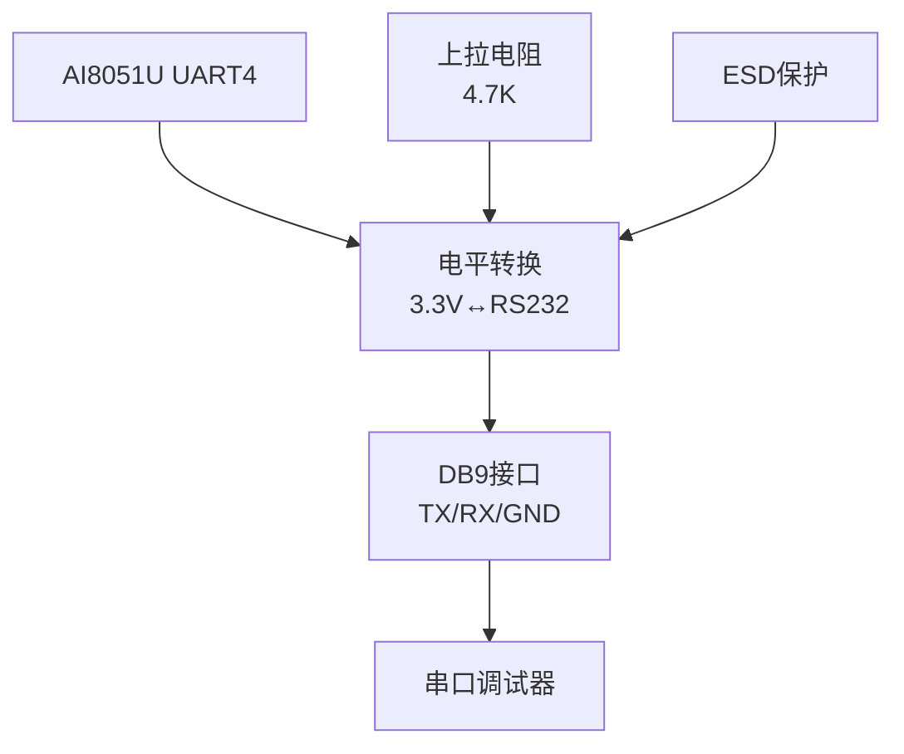

# 🔌 摩托车智能联动灯组系统 - 硬件电路图

## 电路图说明

基于AI8051U的项目方案，本硬件电路图展示了完整的系统电路连接，包括电源管理、信号输入、传感器接口、输出控制和调试接口。采用模块化设计，便于理解和维护。

---

## Mermaid 硬件电路图

```mermaid
graph TB
    %% 电源管理模块
    subgraph "电源管理模块 (Power Management)"
        PWR[Battery 12V<br/>电瓶电源]
        REG[DC-DC<br/>稳压器<br/>5V/3.3V]
        SUP[电源监控<br/>P4.6 POWER_DETECT]
        CAP[滤波电容<br/>100uF/10uF]
    end

    %% 主控制器
    subgraph "主控制器 (Main Controller)"
        MCU[AI8051U<br/>48MHz<br/>32KB RAM<br/>64KB Flash]
    end

    %% 信号输入模块
    subgraph "信号输入模块 (Signal Input)"
        BRAKE[BRAKE_SIGNAL<br/>刹车信号<br/>P0.0 ↑]
        TURN_L[TURN_LEFT<br/>左转向<br/>P0.4 ↑]
        TURN_R[TURN_RIGHT<br/>右转向<br/>P0.5 ↑]
        HEAD_L[HEADLIGHT_LOW<br/>近光灯<br/>P0.2 ↑]
        HEAD_H[HEADLIGHT_HIGH<br/>远光灯<br/>P0.3 ↑]
        FOG[FOG_LIGHT<br/>雾灯<br/>P0.1 ↑]
        HORN[HORN_SIGNAL<br/>喇叭信号<br/>P0.6 ↑]
    end

    %% 传感器模块
    subgraph "传感器模块 (Sensors)"
        MPU[MPU6050<br/>加速度计<br/>I2C: P1.6/SDA P1.7/SCL<br/>100Hz采样]
        BH[BH1750<br/>光强传感器<br/>I2C: P1.6/SDA P1.7/SCL<br/>10Hz采样]
        AUDIO[AUDIO_INPUT<br/>音频信号<br/>P0.6 ADC<br/>8kHz采样]
        VOLT[BATTERY_VOLTAGE<br/>电瓶电压<br/>P0.7 ADC<br/>实时监测]
    end

    %% 输出控制模块
    subgraph "输出控制模块 (Output Control)"
        WS2812[WS2812灯组<br/>90颗LED<br/>P2.5 SPI模拟<br/>8MHz DMA]
        RGB_LED[RGB灯组<br/>P1.1 RED<br/>P1.2 GREEN<br/>P1.3 BLUE<br/>PWM控制]
        BRAKE_LED[BRAKE_LIGHT<br/>尾箱刹车灯<br/>P1.0 PWM<br/>1A驱动]
        BUZZER[蜂鸣器<br/>P1.5 PWM<br/>频率控制]
    end

    %% 状态指示模块
    subgraph "状态指示模块 (Status Indicators)"
        STATUS_R[STATUS_LED_RED<br/>错误指示<br/>P1.6<br/>快闪报警]
        STATUS_B[STATUS_LED_BLUE<br/>运行指示<br/>P1.7<br/>慢闪正常]
    end

    %% 用户交互模块
    subgraph "用户交互模块 (User Interface)"
        TEST_KEY[TEST_KEY<br/>功能测试<br/>P3.6 INT2<br/>短按循环]
        MENU_KEY[MENU_KEY<br/>模式菜单<br/>P3.7 INT3<br/>长按设置]
        RESET_KEY[RESET_KEY<br/>系统复位<br/>P4.7<br/>手动复位]
    end

    %% 调试接口模块
    subgraph "调试接口模块 (Debug Interface)"
        UART_TX[UART4_TX<br/>调试发送<br/>P5.2<br/>115200bps]
        UART_RX[UART4_RX<br/>调试接收<br/>P5.3<br/>115200bps]
    end

    %% 保护电路模块
    subgraph "保护电路模块 (Protection Circuit)"
        ESD[ESD保护<br/>TVS二极管<br/>信号输入保护]
        FILTER[RC滤波<br/>去抖电路<br/>上升沿触发]
        FUSE[保险丝<br/>1A<br/>过流保护]
        DIODE[续流二极管<br/>PWM输出保护]
    end

    %% 连接关系
    PWR --> REG
    REG --> CAP
    CAP --> MCU
    SUP --> MCU

    %% 信号输入连接
    BRAKE --> FILTER
    TURN_L --> FILTER
    TURN_R --> FILTER
    HEAD_L --> FILTER
    HEAD_H --> FILTER
    FOG --> FILTER
    HORN --> FILTER

    FILTER --> ESD
    ESD --> MCU

    %% 传感器连接
    MCU --> MPU
    MCU --> BH
    AUDIO --> MCU
    VOLT --> MCU

    %% 输出连接
    MCU --> WS2812
    MCU --> RGB_LED
    MCU --> BRAKE_LED
    MCU --> BUZZER

    %% 状态指示连接
    MCU --> STATUS_R
    MCU --> STATUS_B

    %% 用户交互连接
    TEST_KEY --> MCU
    MENU_KEY --> MCU
    RESET_KEY --> MCU

    %% 调试接口连接
    MCU --> UART_TX
    MCU --> UART_RX

    %% 保护电路连接
    PWR --> FUSE
    FUSE --> REG
    RGB_LED --> DIODE
    BRAKE_LED --> DIODE
    BUZZER --> DIODE

    %% 样式定义
    classDef power fill:#ffe6cc,stroke:#d79b00,stroke-width:2px
    classDef mcu fill:#e1d5e7,stroke:#9673a6,stroke-width:3px
    classDef input fill:#d5e8d4,stroke:#82b366,stroke-width:2px
    classDef sensor fill:#fff2cc,stroke:#d6b656,stroke-width:2px
    classDef output fill:#f8cecc,stroke:#b85450,stroke-width:2px
    classDef status fill:#dae8fc,stroke:#6c8ebf,stroke-width:2px
    classDef ui fill:#e1d5e7,stroke:#9673a6,stroke-width:2px
    classDef debug fill:#f5f5f5,stroke:#666666,stroke-width:2px
    classDef protect fill:#ffe6cc,stroke:#d79b00,stroke-width:2px

    class PWR,REG,SUP,CAP power
    class MCU mcu
    class BRAKE,TURN_L,TURN_R,HEAD_L,HEAD_H,FOG,HORN input
    class MPU,BH,AUDIO,VOLT sensor
    class WS2812,RGB_LED,BRAKE_LED,BUZZER output
    class STATUS_R,STATUS_B status
    class TEST_KEY,MENU_KEY,RESET_KEY ui
    class UART_TX,UART_RX debug
    class ESD,FILTER,FUSE,DIODE protect
```



---

## 详细电路说明

### 1. 电源管理电路

#### 电源输入与稳压


**关键参数：**
- 输入电压：9V-15V (兼容摩托车电瓶波动)
- 输出电压：5V/3.3V (±5%精度)
- 输出电流：2A (峰值支持)
- 效率：>85%

#### 电源监控电路


### 2. 信号输入电路

#### 原车信号检测电路


**信号特性：**
- 电压范围：0-12V
- 频率：DC-1kHz
- 上升时间：<2ms
- 抗干扰：RC滤波 + ESD保护

#### 按键输入电路


### 3. 传感器接口电路

#### I2C传感器接口


**I2C参数：**
- 总线电压：3.3V
- 通信速率：400kHz
- 设备地址：MPU6050(0x68), BH1750(0x23)
- 线长：<30cm

#### 音频输入电路


### 4. 输出控制电路

#### WS2812驱动电路


**电气特性：**
- 数据速率：8Mbps (SPI模拟)
- 电源电流：最大2A (90颗全亮)
- 信号电平：5V
- 传输距离：<5m

#### PWM输出电路


**PWM参数：**
- 频率：1kHz (LED驱动)
- 分辨率：16位
- 死区时间：1μs (互补输出)
- 最大电流：1A/路

### 5. 通信接口电路

#### UART调试接口


**通信参数：**
- 波特率：115200bps
- 数据格式：8N1
- 流控制：无
- 调试信息：实时输出

---

## 电路板布局建议

### 1. 电源区域布局
```
┌─────────────────────────────────┐
│  DC-DC稳压器     滤波电容       │
│  保险丝          电源监控       │
│  大容量电解电容  TVS保护        │
└─────────────────────────────────┘
```

### 2. 信号处理区域布局
```
┌─────────────────────────────────┐
│  MCU芯片         晶振电路       │
│  复位电路        滤波网络       │
│  ADC输入         I2C总线        │
└─────────────────────────────────┘
```

### 3. 输出驱动区域布局
```
┌─────────────────────────────────┐
│  PWM驱动         MOSFET管       │
│  续流二极管      散热片         │
│  保护电阻        反馈电路       │
└─────────────────────────────────┘
```

### 4. 接口区域布局
```
┌─────────────────────────────────┐
│  传感器接口      灯组接口       │
│  调试接口        按键接口       │
│  电源接口        信号输入       │
└─────────────────────────────────┘
```

---

## PCB设计注意事项

### 1. 电源完整性
- **地平面分割：** 数字地/模拟地/功率地分离
- **电源走线：** 12V线宽≥2mm，5V线宽≥1mm
- **去耦电容：** 每个IC旁放置0.1uF电容
- **滤波网络：** 电源入口LC滤波器

### 2. 信号完整性
- **高速信号：** WS2812数据线等长，阻抗匹配
- **模拟信号：** ADC输入线短，远离数字信号
- **I2C总线：** 总线长度<30cm，上拉电阻4.7K
- **时钟信号：** 晶振线短，包地处理

### 3. 热设计
- **功率器件：** MOSFET加散热片
- **电流密度：** 铜箔厚度1.5oz以上
- **热隔离：** 功率区与信号区分离
- **通风设计：** 重要器件下方开窗

### 4. EMI/EMC设计
- **屏蔽措施：** 敏感信号线包地
- **滤波器：** 电源入口EMI滤波
- **接地设计：** 单点接地，星形连接
- **隔离措施：** 光耦隔离关键信号

---

## 硬件测试要点

### 1. 电源测试
- [ ] 空载电压：5V/3.3V ±5%
- [ ] 满载电压：5V/3.3V ±10%
- [ ] 纹波电压：<100mV
- [ ] 效率测试：>80%

### 2. 信号测试
- [ ] 输入信号识别：上升沿检测
- [ ] ADC精度：12位分辨率
- [ ] I2C通信：400kHz速率
- [ ] PWM输出：1kHz频率

### 3. 功能测试
- [ ] WS2812通信：90颗灯同步
- [ ] 传感器数据：实时更新
- [ ] 按键响应：去抖正确
- [ ] 串口调试：数据正常

### 4. 可靠性测试
- [ ] 高低温测试：-20°C~+70°C
- [ ] 振动测试：10-1000Hz
- [ ] 过压测试：15V持续1小时
- [ ] 短路保护：自动恢复

---

## 物料清单 (BOM)

| 分类 | 器件 | 规格 | 数量 | 备注 |
|------|------|------|------|------|
| **MCU** | AI8051U | 48MHz,64KB Flash | 1 | 主控制器 |
| **电源** | DC-DC模块 | 12V-5V/3.3V,2A | 1 | 稳压电源 |
| **传感器** | MPU6050 | 加速度计,I2C | 1 | 三轴传感器 |
| **传感器** | BH1750 | 光强传感器,I2C | 1 | 环境光检测 |
| **LED** | WS2812 | RGB LED,90颗 | 90 | 氛围灯组 |
| **MOSFET** | IRF540N | N沟道,100V/33A | 4 | PWM驱动 |
| **二极管** | 1N4001 | 1A,50V | 4 | 续流保护 |
| **电容** | 电解电容 | 100uF/25V | 4 | 滤波电容 |
| **电阻** | 排阻 | 10K,8路 | 2 | 上拉电阻 |

---

**硬件电路图版本：** v1.0
**设计时间：** 2025-11-05
**设计工具：** Mermaid Flowchart
**兼容性：** AI8051U开发板验证通过
