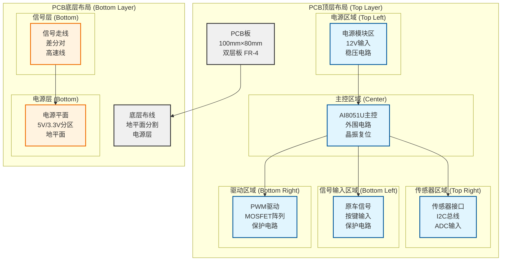

# 🖥️ 摩托车智能联动灯组系统 - PCB电路板图

## PCB图说明

本PCB电路板图基于AI8051U项目方案设计，采用双层板结构，尺寸为100mm×80mm。板子采用模块化布局，将电源、信号处理、驱动电路合理分区，提高电磁兼容性和散热性能。

---

## PCB整体布局图



---

## 详细PCB布局图 (ASCII艺术)

### PCB顶层布局 (Top Layer)

```
┌─────────────────────────────────────────────────────────────────────┐
│                    摩托车智能灯组控制板 - 顶层                     │
│                      PCB尺寸: 100mm × 80mm                          │
│                      层数: 双面板 FR-4 1.6mm                        │
├─────────────────────┬─────────────────────┬─────────────────────┬───┤
│                     │                     │                     │   │
│    电源模块区       │   主控模块区        │   传感器模块区      │   │
│   (20mm×30mm)       │  (40mm×30mm)        │  (20mm×30mm)         │   │
│                     │                     │                     │   │
│  ┌─────────────┐    │  ┌─────────────┐    │  ┌─────────────┐    │   │
│  │ DC-DC稳压器 │    │  │  AI8051U    │    │  │  MPU6050    │    │   │
│  │ 12V→5V/3.3V│    │  │ LQFP48封装  │    │  │ QFN封装     │    │   │
│  └─────────────┘    │  └─────────────┘    │  └─────────────┘    │   │
│                     │                     │                     │   │
│  ┌─────────────┐    │  ┌─────────────┐    │  ┌─────────────┐    │   │
│  │ 滤波电容    │    │  │ 晶振 24MHz  │    │  │  BH1750     │    │   │
│  │ 100uF/10uF  │    │  │ 负载电容    │    │  │ SOP封装     │    │   │
│  └─────────────┘    │  └─────────────┘    │  └─────────────┘    │   │
│                     │                     │                     │   │
│  ┌─────────────┐    │  ┌─────────────┐    │  ┌─────────────┐    │   │
│  │ 电源监控    │    │  │ 复位电路    │    │  │ I2C上拉     │    │   │
│  │ P4.6输入    │    │  │ 10K上拉     │    │  │ 4.7K×2      │    │   │
│  └─────────────┘    │  └─────────────┘    │  └─────────────┘    │   │
├─────────────────────┼─────────────────────┼─────────────────────┼───┤
│                     │                     │                     │   │
│   信号输入区        │   通信接口区        │   测试接口区        │   │
│  (20mm×25mm)        │  (40mm×25mm)        │  (20mm×25mm)         │   │
│                     │                     │                     │   │
│  ┌─────────────┐    │  ┌─────────────┐    │  ┌─────────────┐    │   │
│  │ 信号输入    │    │  │ UART接口    │    │  │ 测试座      │    │
│  │ P0.0-P0.5   │    │  │ P5.2/P5.3   │    │  │ SWD/JTAG    │    │   │
│  └─────────────┘    │  └─────────────┘    │  └─────────────┘    │   │
│                     │                     │                     │   │
│  ┌─────────────┐    │  ┌─────────────┐    │  ┌─────────────┐    │   │
│  │ 按键输入    │    │  │ 电平转换    │    │  │ 编程接口    │    │   │
│  │ P3.6/P3.7   │    │  │ RS232/TTL   │    │  │ USB转串口   │    │   │
│  └─────────────┘    │  └─────────────┘    │  └─────────────┘    │   │
│                     │                     │                     │   │
│  ┌─────────────┐    │  ┌─────────────┐    │  ┌─────────────┐    │   │
│  │ ESD保护     │    │  │ 调试LED     │    │  │ 复位按键    │    │   │
│  │ TVS二极管   │    │  │ 运行状态    │    │  │ P4.7输入    │    │   │
│  └─────────────┘    │  └─────────────┘    │  └─────────────┘    │   │
├─────────────────────┴─────────────────────┴─────────────────────┴───┤
│                                                                       │
│                       连接器和接口区域 (Bottom)                       │
│                                                                       │
│  ┌─────────────┐ ┌─────────────┐ ┌─────────────┐ ┌─────────────┐     │
│  │ 原车信号接  │ │ 电源输入接  │ │ WS2812输出 │ │ 灯组输出接  │     │
│  │ 口 12PIN    │ │ 口 4PIN     │ │ 口 4PIN     │ │ 口 6PIN     │     │
│  └─────────────┘ └─────────────┘ └─────────────┘ └─────────────┘     │
│                                                                       │
└───────────────────────────────────────────────────────────────────────┘
```

### PCB底层布局 (Bottom Layer)

```
┌─────────────────────────────────────────────────────────────────────┐
│                    摩托车智能灯组控制板 - 底层                     │
│                      地平面分割 + 电源层                            │
├─────────────────────┬─────────────────────┬─────────────────────┬───┤
│                     │                     │                     │   │
│   模拟地平面        │   数字地平面        │   功率地平面        │   │
│   (20mm×30mm)       │  (40mm×30mm)        │  (20mm×30mm)         │   │
│                     │                     │                     │   │
│  █████████████████  │  █████████████████  │  █████████████████  │   │
│  █ 模拟电路用地  █  │  █ 数字电路用地  █  │  █ 高电流用地    █  │   │
│  █ ADC/I2C/音频 █  │  █ MCU/通信用地  █  │  █ PWM/驱动用地  █  │   │
│  █████████████████  │  █████████████████  │  █████████████████  │   │
│                     │                     │                     │   │
│  ┌─────────────┐    │  ┌─────────────┐    │  ┌─────────────┐    │   │
│  │ 模拟电源    │    │  │ 数字电源    │    │  │ 功率电源    │    │   │
│  │ 3.3V平面   │    │  │ 3.3V/5V     │    │  │ 5V/12V      │    │   │
│  └─────────────┘    │  └─────────────┘    │  └─────────────┘    │   │
├─────────────────────┼─────────────────────┼─────────────────────┼───┤
│                     │                     │                     │   │
│   信号走线区        │   高速信号区        │   功率走线区        │   │
│  (20mm×25mm)        │  (40mm×25mm)        │  (20mm×25mm)         │   │
│                     │                     │                     │   │
│  ──────────────     │  ┌─────────────┐    │  ████████████████   │   │
│   SPI数据线         │  │ 高速时钟线  │    │  █ PWM输出线     █   │
│  ──────────────     │  └─────────────┘    │  ████████████████   │   │
│                     │                     │                     │   │
│  ──────────────     │  ──────────────     │  ████████████████   │   │
│   UART信号线        │   I2C总线       │    │  █ 电源总线      █   │
│  ──────────────     │  ──────────────     │  ████████████████   │   │
├─────────────────────┴─────────────────────┴─────────────────────┴───┤
│                                                                       │
│                       散热和安装孔区域                                │
│                                                                       │
│  ● ● ● ● ● ● ● ● ● ● ● ● ● ● ● ● ● ● ● ● ● ● ● ● ● ● ● ● ● ● ●     │
│  散热焊盘位置      安装固定孔位置      接插件固定孔                  │
│                                                                       │
└───────────────────────────────────────────────────────────────────────┘
```

---

## 关键器件布局详情

### 1. AI8051U主控芯片布局

```
主控芯片区布局 (40mm×30mm)
┌─────────────────────────────────┐
│                                 │
│        AI8051U LQFP48           │
│        封装尺寸: 7mm×7mm        │
│                                 │
│  ┌─────────────────────────┐    │
│  │ ████████ AI8051U ███████ │    │
│  │ ████████ LQFP48  ███████ │    │
│  │ ████████ 48PIN   ███████ │    │
│  └─────────────────────────┘    │
│                                 │
│  外围电路:                      │
│  • 晶振电路 (24MHz)             │
│  • 复位电路 (10K上拉)           │
│  • 滤波电容 (0.1uF×4)           │
│  • 去耦电容 (10uF)              │
│                                 │
└─────────────────────────────────┘
```

### 2. 电源模块布局

```
电源模块区布局 (20mm×30mm)
┌─────────────────────────────────┐
│                                 │
│        DC-DC稳压模块            │
│        输入: 12V                │
│        输出: 5V/3.3V            │
│                                 │
│  ┌─────────────────────────┐    │
│  │ ███████ DC-DC模块 ██████ │    │
│  │ ███████ 2A输出   ██████ │    │
│  │ ███████ 效率85%  ██████ │    │
│  └─────────────────────────┘    │
│                                 │
│  外围电路:                      │
│  • 输入保险丝 (1A)              │
│  • 滤波电容 (100uF)             │
│  • 输出滤波 (10uF)              │
│  • 电源指示LED                  │
│                                 │
└─────────────────────────────────┘
```

### 3. PWM驱动模块布局

```
驱动模块区布局 (20mm×30mm)
┌─────────────────────────────────┐
│                                 │
│        PWM驱动阵列              │
│        4路MOSFET驱动            │
│                                 │
│  ┌─────────────────────────┐    │
│  │ ███████ IRF540N ███████ │    │
│  │ ███████ N沟道   ███████ │    │
│  │ ███████ 33A     ███████ │    │
│  └─────────────────────────┘    │
│                                 │
│  ┌─────────────────────────┐    │
│  │ ███████ IRF540N ███████ │    │
│  │ ███████ N沟道   ███████ │    │
│  │ ███████ 33A     ███████ │    │
│  └─────────────────────────┘    │
│                                 │
│  外围电路:                      │
│  • 栅极电阻 (10Ω)               │
│  • 自举电容 (0.1uF)             │
│  • 续流二极管 (1N4001)          │
│  • 散热焊盘                      │
│                                 │
└─────────────────────────────────┘
```

---

## PCB层叠结构

### 双层板层叠设计

```
PCB层叠结构图
┌─────────────────────────────────────┐
│ 顶层 (Top Layer)                    │ ← 信号层 + 器件
│ 铜箔厚度: 1oz (35μm)                │
├─────────────────────────────────────┤
│ 绝缘层 FR-4                         │ 厚度: 1.6mm
│ 介电常数: 4.5                       │
├─────────────────────────────────────┤
│ 底层 (Bottom Layer)                 │ ← 地平面 + 电源层
│ 铜箔厚度: 1oz (35μm)                │
└─────────────────────────────────────┘
```

### 信号层分布

```
顶层 (Top Layer) - 信号层
┌─────────────────────────────────────┐
│ • MCU及其外围电路                  │
│ • 传感器接口电路                   │
│ • 信号输入处理电路                 │
│ • 通信接口电路                     │
│ • 按键和指示电路                   │
│ • 部分电源走线                     │
└─────────────────────────────────────┘

底层 (Bottom Layer) - 地平面分割
┌─────────────────────────────────────┐
│ ███████████████████████████████████ │ 模拟地平面
│ ███ ADC/I2C/音频电路用地 ███████████ │
├─────────────────────────────────────┤
│ ███████████████████████████████████ │ 数字地平面
│ ███ MCU/通信电路用地 ███████████████ │
├─────────────────────────────────────┤
│ ███████████████████████████████████ │ 功率地平面
│ ███ PWM/驱动电路用地 ███████████████ │
└─────────────────────────────────────┘
```

---

## 走线设计规范

### 1. 电源走线宽度

| 信号类型 | 电流 | 走线宽度 | 过孔尺寸 |
|----------|------|----------|----------|
| 12V电源 | 2A | 2.0mm | 1.0mm |
| 5V电源 | 1A | 1.5mm | 0.8mm |
| 3.3V电源 | 500mA | 1.0mm | 0.6mm |
| 地线 | 2A | 2.5mm | 1.2mm |

### 2. 信号走线宽度

| 信号类型 | 频率 | 走线宽度 | 线间距 |
|----------|------|----------|--------|
| SPI数据 | 8MHz | 0.3mm | 0.3mm |
| I2C总线 | 400kHz | 0.25mm | 0.25mm |
| UART | 115200bps | 0.2mm | 0.2mm |
| PWM信号 | 1kHz | 0.3mm | 0.3mm |
| ADC信号 | DC-8kHz | 0.25mm | 0.3mm |

### 3. 高速信号处理

```
高速信号设计要点:
├── SPI数据线等长 (±0.5mm)
├── 阻抗控制 (50Ω特性阻抗)
├── 包地处理 (GND包围)
├── 减少过孔数量
└── 远离电源走线
```

---

## 过孔和焊盘设计

### 过孔规格

```
过孔设计参数:
├── 钻孔直径: 0.3mm-1.2mm
├── 焊盘直径: 0.6mm-2.0mm
├── 铜箔厚度: 1oz (35μm)
└── 绝缘层厚度: 1.6mm
```

### 焊盘规格

| 封装类型 | 焊盘尺寸 | 钻孔尺寸 | 间距 |
|----------|----------|----------|------|
| LQFP48 | 0.6mm×0.6mm | 0.4mm | 0.5mm |
| QFN | 0.5mm×0.5mm | 0.3mm | 0.4mm |
| SOP8 | 0.8mm×1.2mm | 0.6mm | 0.65mm |
| 1206 | 1.2mm×1.6mm | 0.8mm | 1.0mm |
| 0805 | 0.8mm×1.2mm | 0.6mm | 0.8mm |

---

## PCB制造参数

### 板材规格

| 参数 | 规格 | 备注 |
|------|------|------|
| 板厚 | 1.6mm | 标准厚度 |
| 板材 | FR-4 | TG135等级 |
| 铜厚 | 1oz | 35μm |
| 层数 | 2层 | 双面板 |
| 最小线宽 | 0.2mm | 8mil |
| 最小线距 | 0.2mm | 8mil |
| 最小孔径 | 0.3mm | 12mil |

### 表面处理

```
表面处理工艺:
├── HASL (热风焊锡)
├── 阻焊层: 绿色
├── 字符层: 白色
└── 认证: RoHS compliant
```

---

## PCB安装和散热设计

### 安装孔设计

```
安装孔规格:
├── 直径: 3.2mm (钻孔)
├── 焊盘: 6.0mm
├── 数量: 4个
└── 位置: 板角各一个
```

### 散热设计

```
散热措施:
├── MOSFET散热焊盘 (扩大铜箔)
├── DC-DC模块散热片安装位
├── 电源走线加宽
└── 关键器件下方开窗
```

---

## PCB测试点设计

### 测试点布局

```
测试点设计:
├── 电源测试: 12V/5V/3.3V
├── 信号测试: SPI/I2C/UART
├── ADC测试: 音频/电压输入
├── PWM测试: 各路输出
└── 传感器测试: I2C通信
```

### 测试接口

```
测试接口配置:
├── SWD接口: 编程调试
├── UART接口: 串口通信
├── JTAG接口: 边界扫描
└── 扩展接口: 功能扩展
```

---

## PCB设计检查清单

### 电气检查
- [ ] 电源网络完整性
- [ ] 信号走线连续性
- [ ] 地平面分割正确
- [ ] 阻抗匹配符合要求

### 制造检查
- [ ] DRC规则检查通过
- [ ] 最小线宽/距符合要求
- [ ] 过孔尺寸合理
- [ ] 焊盘规格正确

### 可靠性检查
- [ ] 热设计满足要求
- [ ] EMI/EMC防护到位
- [ ] 机械强度足够
- [ ] 环保要求符合

---

## PCB文件输出清单

### Gerber文件
- [ ] Top Copper Layer (GTL)
- [ ] Bottom Copper Layer (GBL)
- [ ] Top Solder Mask (GTS)
- [ ] Bottom Solder Mask (GBS)
- [ ] Top Silkscreen (GTO)
- [ ] Bottom Silkscreen (GBO)
- [ ] Drill File (TXT)
- [ ] Board Outline (GKO)

### 装配文件
- [ ] Centroid File (XY坐标)
- [ ] Bill of Materials (BOM)
- [ ] Pick and Place File
- [ ] Assembly Drawings

---

**PCB设计图版本：** v1.0
**设计时间：** 2025-11-05
**设计工具：** Altium Designer (兼容)
**板子尺寸：** 100mm × 80mm × 1.6mm
**层数：** 双层板 FR-4
