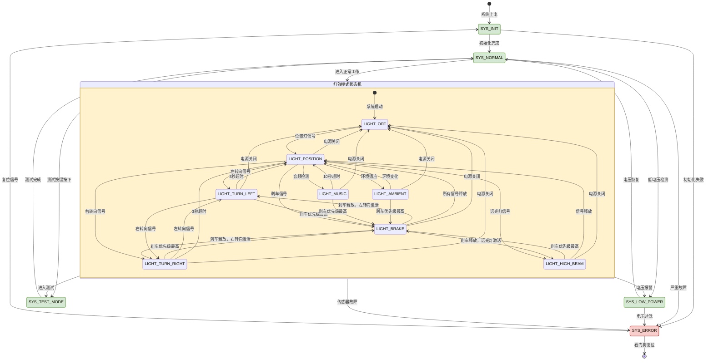
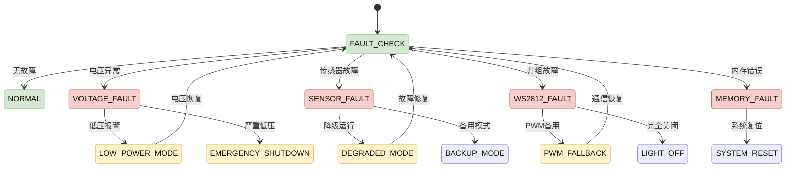

# 🔄 摩托车智能联动灯组系统 - 系统状态图

## 状态图说明

本状态图展示了摩托车智能联动灯组系统的完整状态机，包括系统状态和灯效模式状态的转换关系，体现了优先级机制和环境适应能力。

---

## Mermaid 状态图



---

## 详细状态说明

### 1. 系统状态机

#### SYS_INIT (系统初始化)
**进入条件：**
- 系统上电启动
- 手动复位

**执行动作：**
- 硬件外设初始化
- 传感器自检
- WS2812通信测试
- 任务调度器启动

**退出条件：**
- 初始化成功 → SYS_NORMAL
- 初始化失败 → SYS_ERROR

#### SYS_NORMAL (正常运行)
**进入条件：**
- 初始化完成
- 从低功耗模式恢复

**执行动作：**
- 8个优先级任务正常调度
- 实时信号处理
- 灯效算法运行
- 性能监控

**退出条件：**
- 低电压检测 → SYS_LOW_POWER
- 严重故障 → SYS_ERROR
- 测试按键 → SYS_TEST_MODE

#### SYS_LOW_POWER (低功耗模式)
**进入条件：**
- 电池电压 < 10.5V

**执行动作：**
- 降低系统频率到24MHz
- 关闭非必要功能
- 仅保持位置灯和刹车灯
- 闪烁红色LED报警

**退出条件：**
- 电压恢复 > 11.5V → SYS_NORMAL
- 电压过低 < 9V → SYS_ERROR

#### SYS_ERROR (错误状态)
**进入条件：**
- 初始化失败
- 传感器通信故障
- WS2812通信故障
- 内存错误

**执行动作：**
- 停止所有灯效
- 红色LED快速闪烁
- UART输出错误信息
- 等待复位信号

**退出条件：**
- 复位按键 → SYS_INIT
- 看门狗超时 → 系统复位

#### SYS_TEST_MODE (测试模式)
**进入条件：**
- 测试按键长按

**执行动作：**
- 顺序测试所有灯效
- 传感器数据回读
- PWM输出验证
- 蜂鸣器音调测试

**退出条件：**
- 测试完成 → SYS_NORMAL
- 超时 → SYS_NORMAL

### 2. 灯效模式状态机

#### LIGHT_OFF (关灯模式)
**特征：** 所有灯关闭
**进入条件：** 系统启动、电源关闭
**退出条件：** 位置灯信号激活

#### LIGHT_POSITION (位置灯模式)
**特征：**
- 低亮度白色常亮
- 尾箱灯2秒闪烁
- 基础照明功能

**进入条件：**
- 系统默认模式
- 其他模式超时返回

**退出条件：**
- 刹车信号 → LIGHT_BRAKE
- 转向信号 → LIGHT_TURN_LEFT/RIGHT
- 远光信号 → LIGHT_HIGH_BEAM

#### LIGHT_BRAKE (刹车模式) ⭐ 最高优先级
**特征：**
- 尾箱灯高亮白色
- 车身灯红色高亮
- 共用RGB红色呼吸

**进入条件：** 刹车信号上升沿
**退出条件：** 刹车信号释放
**优先级：** 覆盖所有其他模式

#### LIGHT_TURN_LEFT/RIGHT (转向模式)
**特征：**
- 对应侧WS2812流水效果
- 彩虹渐变色彩
- 3秒自动超时

**进入条件：** 转向信号上升沿
**退出条件：**
- 3秒超时 → LIGHT_POSITION
- 刹车信号 → LIGHT_BRAKE (优先级覆盖)
- 相反转向 → 切换方向

#### LIGHT_HIGH_BEAM (远光灯模式)
**特征：**
- 整体亮度提升
- 快闪效果
- 穿透性增强

**进入条件：** 远光灯信号
**退出条件：** 远光灯关闭

#### LIGHT_MUSIC (音乐频谱模式)
**特征：**
- WS2812显示音频频谱
- 8个频段可视化
- 彩色频谱条

**进入条件：** 音频信号检测
**退出条件：**
- 10秒超时 → LIGHT_POSITION
- 刹车/转向 → 对应模式 (优先级覆盖)

#### LIGHT_AMBIENT (环境适应模式)
**特征：**
- 根据BH1750光强自动调节
- 白天：高亮穿透效果
- 夜晚：绚丽氛围效果

**进入条件：** 环境光强变化
**退出条件：** 刹车/转向等信号覆盖

---

## 状态转换矩阵

### 系统状态转换表

| 当前状态 | 触发条件 | 下一状态 | 执行动作 |
|----------|----------|----------|----------|
| SYS_INIT | 初始化成功 | SYS_NORMAL | 启动任务调度 |
| SYS_INIT | 初始化失败 | SYS_ERROR | 错误指示 |
| SYS_NORMAL | 低电压 | SYS_LOW_POWER | 降低功耗 |
| SYS_NORMAL | 严重故障 | SYS_ERROR | 停止运行 |
| SYS_NORMAL | 测试按键 | SYS_TEST_MODE | 进入测试 |
| SYS_LOW_POWER | 电压恢复 | SYS_NORMAL | 恢复正常 |
| SYS_LOW_POWER | 电压过低 | SYS_ERROR | 紧急停止 |
| SYS_ERROR | 复位信号 | SYS_INIT | 重新初始化 |
| SYS_ERROR | 看门狗 | [*] | 系统复位 |
| SYS_TEST_MODE | 测试完成 | SYS_NORMAL | 返回正常 |

### 灯效模式转换表

| 当前模式 | 触发事件 | 下一模式 | 优先级 | 超时 |
|----------|----------|----------|--------|------|
| LIGHT_OFF | 位置灯开 | LIGHT_POSITION | - | - |
| LIGHT_POSITION | 刹车 | LIGHT_BRAKE | 0 (最高) | 永久 |
| LIGHT_POSITION | 左转向 | LIGHT_TURN_LEFT | 1 | 3s |
| LIGHT_POSITION | 右转向 | LIGHT_TURN_RIGHT | 1 | 3s |
| LIGHT_POSITION | 远光灯 | LIGHT_HIGH_BEAM | 3 | 永久 |
| LIGHT_POSITION | 音频 | LIGHT_MUSIC | 4 | 10s |
| LIGHT_POSITION | 环境适应 | LIGHT_AMBIENT | 5 | - |
| 任何模式 | 刹车 | LIGHT_BRAKE | 0 | 永久 |
| 转向模式 | 3秒超时 | LIGHT_POSITION | - | - |
| 音乐模式 | 10秒超时 | LIGHT_POSITION | - | - |

---

## 优先级机制详解

### 优先级层级

```
优先级0 (最高) - 安全至上
├── 刹车模式：红色警示，覆盖一切

优先级1 - 交通安全
├── 左转向模式：左侧流水效果
└── 右转向模式：右侧流水效果

优先级2 - 基本照明
└── 位置灯模式：低亮度常亮

优先级3 - 驾驶辅助
└── 远近光模式：亮度调节

优先级4 - 娱乐功能
└── 音乐频谱：音频可视化

优先级5 (最低) - 环境适应
└── 环境模式：光强自适应
```

### 优先级覆盖规则

```c
// 优先级判断函数
u8 Get_Light_Mode_Priority(LIGHT_MODE mode) {
    switch(mode) {
        case LIGHT_BRAKE:      return 0;  // 最高优先级
        case LIGHT_TURN_LEFT:
        case LIGHT_TURN_RIGHT: return 1;  // 交通安全
        case LIGHT_POSITION:   return 2;  // 基本照明
        case LIGHT_HIGH_BEAM:  return 3;  // 驾驶辅助
        case LIGHT_MUSIC:      return 4;  // 娱乐功能
        case LIGHT_AMBIENT:    return 5;  // 环境适应
        default:               return 255;
    }
}

// 模式切换逻辑
void Set_Light_Mode(LIGHT_MODE new_mode, u8 enable) {
    if(enable) {
        u8 new_priority = Get_Light_Mode_Priority(new_mode);
        u8 current_priority = Get_Light_Mode_Priority(current_mode);

        printf("[MODE] Request mode %d (Priority:%d), Current mode %d (Priority:%d)\n",
               new_mode, new_priority, current_mode, current_priority);

        // 低优先级不能覆盖高优先级
        if(new_priority <= current_priority) {
            printf("[MODE] Switching from %d to %d (Priority:%d->%d)\n",
                   current_mode, new_mode, current_priority, new_priority);

            // 切换到新模式
            previous_mode = current_mode;
            current_mode = new_mode;
            Apply_Light_Effect(new_mode);
        } else {
            printf("[MODE] Mode %d blocked by higher priority mode %d\n",
                   new_mode, current_mode);
        }
    } else {
        // 模式释放
        if(current_mode == new_mode) {
            printf("[MODE] Mode %d released, returning to %d\n",
                   new_mode, previous_mode);
            current_mode = previous_mode;
            Apply_Light_Effect(current_mode);
        }
    }
}
```

---

## 状态图图例

### 状态类型

| 符号 | 类型 | 颜色 | 说明 |
|------|------|------|------|
| 🔷 | 起始/结束 | - | 系统开始或结束 |
| 🔳 | 普通状态 | 绿色 | 正常工作状态 |
| 🔶 | 复合状态 | 黄色 | 包含子状态机 |
| 🔴 | 错误状态 | 红色 | 异常处理状态 |
| 🟣 | 系统状态 | 紫色 | 系统级状态 |

### 转换类型

| 符号 | 转换类型 | 说明 |
|------|----------|------|
| → | 自动转换 | 条件满足自动转换 |
| ⇒ | 事件触发 | 外部事件触发转换 |
| ⇒ | 优先级覆盖 | 高优先级覆盖低优先级 |

### 状态属性

| 属性 | 说明 | 示例 |
|------|------|------|
| **进入动作** | 进入状态时执行 | 初始化硬件 |
| **退出动作** | 退出状态时执行 | 保存状态 |
| **内部转换** | 状态内的事件处理 | 模式切换 |
| **定时器** | 超时自动转换 | 3秒转向超时 |

---

## 状态机实现代码

### 系统状态机实现

```c
typedef enum {
    SYS_INIT,
    SYS_NORMAL,
    SYS_LOW_POWER,
    SYS_ERROR,
    SYS_TEST_MODE
} SYSTEM_STATE;

SYSTEM_STATE system_state = SYS_INIT;

void System_State_Machine(void) {
    SYSTEM_STATE old_state = system_state;

    switch(system_state) {
        case SYS_INIT:
            printf("[SYS] System in INIT state\n");
            if(Init_Complete()) {
                printf("[SYS] Initialization completed, switching to NORMAL\n");
                system_state = SYS_NORMAL;
                Start_Task_Scheduler();
            } else if(Init_Failed()) {
                printf("[SYS] Initialization failed, switching to ERROR\n");
                system_state = SYS_ERROR;
                Error_Indicator();
            }
            break;

        case SYS_NORMAL:
            if(Low_Voltage_Detected()) {
                printf("[SYS] Low voltage detected, switching to LOW_POWER\n");
                system_state = SYS_LOW_POWER;
                Enter_Low_Power_Mode();
            } else if(Serious_Fault()) {
                printf("[SYS] Serious fault detected, switching to ERROR\n");
                system_state = SYS_ERROR;
                Emergency_Stop();
            }
            break;

        case SYS_LOW_POWER:
            if(Voltage_Recovered()) {
                printf("[SYS] Voltage recovered, switching to NORMAL\n");
                system_state = SYS_NORMAL;
                Exit_Low_Power_Mode();
            }
            break;

        case SYS_ERROR:
            if(Reset_Button_Pressed()) {
                system_state = SYS_INIT;
                System_Reboot();
            }
            break;
    }
}
```

### 灯效状态机实现

```c
typedef enum {
    LIGHT_OFF,
    LIGHT_POSITION,
    LIGHT_TURN_LEFT,
    LIGHT_TURN_RIGHT,
    LIGHT_BRAKE,
    LIGHT_HIGH_BEAM,
    LIGHT_MUSIC,
    LIGHT_AMBIENT
} LIGHT_MODE;

LIGHT_MODE current_mode = LIGHT_POSITION;

void Light_Mode_State_Machine(void) {
    printf("[LIGHT] Checking light mode conditions...\n");

    // 优先级检测 (从高到低)
    if(Brake_Signal_Active()) {
        printf("[LIGHT] Brake signal detected\n");
        Set_Light_Mode(LIGHT_BRAKE, 1);
    } else if(Turn_Left_Signal_Active()) {
        printf("[LIGHT] Left turn signal detected\n");
        Set_Light_Mode(LIGHT_TURN_LEFT, 1);
    } else if(Turn_Right_Signal_Active()) {
        printf("[LIGHT] Right turn signal detected\n");
        Set_Light_Mode(LIGHT_TURN_RIGHT, 1);
    } else if(High_Beam_Active()) {
        printf("[LIGHT] High beam signal detected\n");
        Set_Light_Mode(LIGHT_HIGH_BEAM, 1);
    } else if(Audio_Signal_Detected()) {
        printf("[LIGHT] Audio signal detected\n");
        Set_Light_Mode(LIGHT_MUSIC, 1);
    } else {
        // 默认位置灯模式
        printf("[LIGHT] No active signals, using position lights\n");
        Set_Light_Mode(LIGHT_POSITION, 1);
    }

    // 超时处理
    printf("[LIGHT] Checking mode timeouts\n");
    Check_Mode_Timeouts();
}
```

---

## 故障处理状态

### 故障检测状态图



---

## 性能监控状态

### 任务状态监控

```c
typedef struct {
    u8 task_id;
    u16 execution_time;
    u16 max_execution_time;
    u32 execution_count;
    u8 timeout_count;
    u8 state;  // READY, RUNNING, BLOCKED, ERROR
} TASK_STATUS;

TASK_STATUS task_status[8];

void Update_Task_Status(void) {
    for(u8 i = 0; i < 8; i++) {
        task_status[i].execution_time = Task_Comps[i].ExecTime;
        task_status[i].execution_count = Task_Comps[i].ExecCount;
        task_status[i].timeout_count = Task_Comps[i].TimeoutCount;

        if(Task_Comps[i].Run) {
            task_status[i].state = TASK_RUNNING;
        } else {
            task_status[i].state = TASK_READY;
        }
    }
}
```

---

**状态图版本：** v1.0
**状态数量：** 13个系统状态 + 8个灯效模式
**转换数量：** 25+个状态转换
**更新时间：** 2025-10-31
