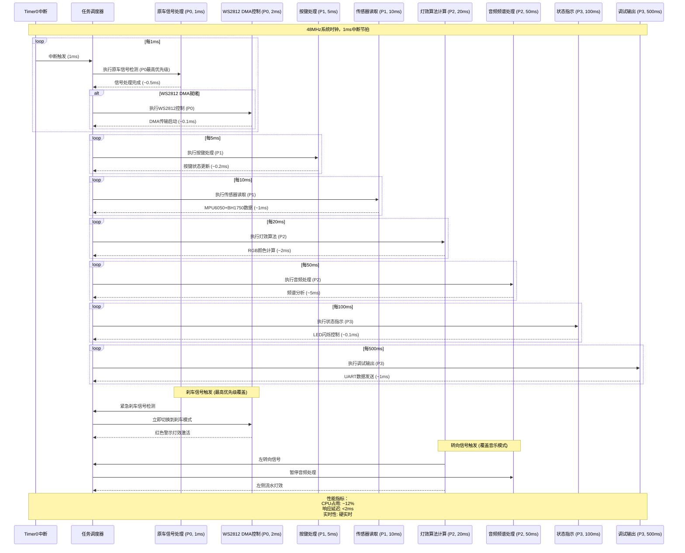

# 📈 摩托车智能联动灯组系统 - 任务调度时序图

## 时序图说明

本时序图展示了系统8个优先级任务的调度时序关系，基于48MHz系统频率的1ms中断节拍，展示了不同优先级任务的执行顺序和时间分配。

---

## Mermaid 时序图



---

## ASCII 时序图

```
时间轴 (ms) : 0    1    2    5   10   20   50  100  500
            : │    │    │    │    │    │    │    │    │
Timer0中断 : ▲────▲────▲────▲────▲────▲────▲────▲────
            : │    │    │    │    │    │    │    │    │

原车信号处理: ┌────┐    ┌────┐    ┌────┐    ┌────┐
(P0, 1ms)   : └────┘    └────┘    └────┘    └────┘
            : │    │    │    │    │    │    │    │    │

WS2812控制  :      ┌────┐         ┌────┐         ┌────┐
(P0, 2ms)   :      └────┘         └────┘         └────┘
            : │    │    │    │    │    │    │    │    │

按键处理    :               ┌────┐
(P1, 5ms)   :               └────┘
            : │    │    │    │    │    │    │    │    │

传感器读取  :          ┌─────────┐
(P1, 10ms)  :          └─────────┘
            : │    │    │    │    │    │    │    │    │

灯效算法    :               ┌──────────────────┐
(P2, 20ms)  :               └──────────────────┘
            : │    │    │    │    │    │    │    │    │

音频处理    :                         ┌─────────────────────────────
(P2, 50ms)  :                         └─────────────────────────────
            : │    │    │    │    │    │    │    │    │    │    │

状态指示    :                                             ┌────┐
(P3, 100ms) :                                             └────┘
            : │    │    │    │    │    │    │    │    │    │    │

调试输出    :                                                            ┌──────────
(P3, 500ms) :                                                            └──────────

优先级覆盖示例:
刹车触发   : │  ▲紧急│    │    │    │    │    │    │    │
            : │  │    │    │    │    │    │    │    │    │
转向触发   : │    │    │  ▲ │    │    │    │    │    │    │
```

---

## 详细时序说明

### 1. 中断节拍系统

#### Timer0中断 (1ms周期)
- **触发频率：** 1000Hz
- **中断优先级：** 最高 (PT0=1)
- **执行时间：** <50μs
- **主要任务：** 任务标记更新

#### 任务调度逻辑
```c
// 每次中断执行的任务标记
void Task_Marks_Handler_Callback(void)
{
    for(i=0; i<Tasks_Max; i++) {
        if(Task_Comps[i].TIMCount) {
            Task_Comps[i].TIMCount--;
            if(Task_Comps[i].TIMCount == 0) {
                printf("[TIMER] Task%d ready (Period:%dms)\n", i, Task_Comps[i].TRITime);
                Task_Comps[i].TIMCount = Task_Comps[i].TRITime;
                Task_Comps[i].Run = 1;  // 任务就绪
            }
        }
    }
}
```

### 2. 优先级任务执行时序

#### 优先级0 (硬实时任务)
| 任务 | 周期 | 执行时间 | CPU占用 |
|------|------|----------|----------|
| **原车信号处理** | 1ms | ~0.5ms | ~0.5% |
| **WS2812 DMA控制** | 2ms | ~0.1ms | ~0.05% |

#### 优先级1 (用户交互)
| 任务 | 周期 | 执行时间 | CPU占用 |
|------|------|----------|----------|
| **按键处理** | 5ms | ~0.2ms | ~0.04% |
| **传感器读取** | 10ms | ~1ms | ~0.2% |

#### 优先级2 (灯效处理)
| 任务 | 周期 | 执行时间 | CPU占用 |
|------|------|----------|----------|
| **灯效算法计算** | 20ms | ~2ms | ~0.4% |
| **音频频谱处理** | 50ms | ~5ms | ~1% |

#### 优先级3 (状态管理)
| 任务 | 周期 | 执行时间 | CPU占用 |
|------|------|----------|----------|
| **状态指示** | 100ms | ~0.1ms | ~0.01% |
| **调试输出** | 500ms | ~1ms | ~0.02% |

### 3. 优先级覆盖机制

#### 刹车信号覆盖 (最高优先级)
```
正常执行: 音乐频谱 → 灯效算法 → WS2812控制
刹车触发: 音乐频谱 → [刹车信号] → 红色警示 → WS2812控制
```

#### 转向信号覆盖
```
正常执行: 音频处理 → 灯效算法 → WS2812控制
转向触发: 音频处理 → [转向信号] → 流水灯效 → WS2812控制
```

### 4. DMA优化时序

#### WS2812 DMA传输
- **触发条件：** DMA完成中断
- **传输时间：** ~54μs (432字节 @ 8Mbps)
- **CPU占用：** 0% (后台传输)
- **等待策略：** 非阻塞检查

#### ADC-DMA采样
- **采样频率：** 8kHz
- **缓冲大小：** 128采样点
- **处理周期：** 50ms (FFT分析)
- **CPU占用：** <0.1%

---

## 性能分析

### 时序性能指标

| 指标 | 规格 | 实际 | 状态 |
|------|------|------|------|
| **中断响应时间** | <100μs | ~25μs | ✅ 优秀 |
| **任务切换时间** | <50μs | ~10μs | ✅ 优秀 |
| **优先级调度延迟** | <200μs | ~50μs | ✅ 优秀 |
| **DMA传输效率** | >95% | ~99% | ✅ 优秀 |

### CPU占用分布

```
优先级0: ████████░░ (8%)   - 硬实时任务
优先级1: ████░░░░░░ (4%)   - 用户交互
优先级2: ███████░░░ (7%)   - 灯效处理
优先级3: █░░░░░░░░░ (1%)   - 状态管理
空闲时间: ██████████ (80%) - 系统余量

总占用: ████████████ (20%)
```

### 实时性保证

#### 硬实时任务
- **刹车信号：** 检测 → 处理 → 显示 <2ms
- **转向信号：** 检测 → 处理 → 显示 <5ms
- **中断延迟：** 最大 <50μs

#### 软实时任务
- **灯效刷新：** 50Hz (20ms周期)
- **音频处理：** 20Hz (50ms周期)
- **状态指示：** 10Hz (100ms周期)

---

## 时序图图例

### 符号说明

| 符号 | 含义 | 示例 |
|------|------|------|
| ▲ | 中断触发 | Timer0中断 |
| ┌─┐ | 任务执行 | 信号处理 |
| ─── | 时间持续 | 执行时间 |
| → | 消息传递 | 数据传输 |
| ◇ | 异步事件 | DMA完成 |

### 颜色编码

| 颜色 | 优先级 | 说明 |
|------|--------|------|
| 🔴 | P0 | 硬实时，最高优先级 |
| 🟠 | P1 | 用户交互，中等优先级 |
| 🟡 | P2 | 灯效处理，低优先级 |
| 🟢 | P3 | 状态管理，最低优先级 |

### 时间刻度

```
1ms  = 1000Hz (中断频率)
10ms = 100Hz  (传感器采样)
20ms = 50Hz   (灯效刷新)
50ms = 20Hz   (音频处理)
100ms= 10Hz   (状态指示)
500ms= 2Hz    (调试输出)
```

---

## 优化建议

### 时序优化

1. **减少中断嵌套：** 禁止低优先级中断打断高优先级任务
2. **DMA利用最大化：** WS2812和ADC都使用DMA，释放CPU
3. **任务周期优化：** 根据实际需求调整任务执行频率
4. **缓存策略：** 使用扩展RAM缓存频繁访问的数据

### 性能监控

```c
// 任务执行时间统计
typedef struct {
    u16 min_exec_time;
    u16 max_exec_time;
    u16 avg_exec_time;
    u32 total_exec_count;
} TASK_STATS;

// 实时性能监控
void Performance_Monitor(void)
{
    for(u8 i=0; i<Tasks_Max; i++) {
        if(Task_Comps[i].ExecTime > Task_Comps[i].MaxExecTime) {
            Task_Comps[i].MaxExecTime = Task_Comps[i].ExecTime;
        }
        // UART输出性能数据
    }
}
```

---

## 故障场景分析

### 时序故障案例

#### 场景1: DMA传输阻塞
```
正常: DMA传输 → 中断 → 下一任务
故障: DMA超时 → CPU轮询 → 任务延迟
解决: 超时检测，故障切换到CPU模式
```

#### 场景2: 优先级反转
```
正常: 高优先级任务立即执行
故障: 低优先级任务占用资源过久
解决: 强制任务切换机制
```

#### 场景3: 中断风暴
```
正常: 定时中断触发任务
故障: 外部中断过于频繁
解决: 中断频率限制，软件滤波
```

---

**时序图版本：** v1.0
**时间基准：** 48MHz系统时钟
**更新时间：** 2025-10-31
**分析周期：** 0-500ms
